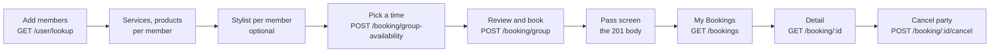

# Mobile Group Booking: FE Implementation Guide

Date: 2026-09-25. For: the mobile app team.

## Overview

A group booking is ONE booking for 2 to 8 people at one salon, all arriving at the same start time, and it is **paid at the salon**. Each member has their own services, their own stylist and, if they want, their own products.

- **Base URL:** `https://api.gostyle.uk/api/v1`
- **Auth:** `Authorization: Bearer <app login token>` on every call. The booker is always the signed-in user, never a field in the body.
- **Content type:** `application/json` on every call with a body.
- **Times:** ISO 8601 with an offset. Always show them in the salon's local time.
- **Money:** decimal AED with at most 2 decimals (`719.25`). The server decides every figure; the app shows what comes back.

What changed from the original app spec (`docs/APP_GROUP_BOOKING_SPEC.md`):

| Topic | App spec said | What the API does now |
| --- | --- | --- |
| Payment | Create as `DRAFT`, pay with `PATCH /booking/:id` | Saved to **pay at the salon**. No payment step in the app yet (another team builds it). |
| `status` after create | `BOOKED` | `CONFIRMED_BY_SALON` |
| `payment_status` after create | `DRAFT` | `PAY_AFTER_CHECK_IN` |
| `expires_at` | A draft hold time | Always `null`. A party never expires or auto-cancels. |
| Cancel | Not in the spec | `POST /booking/:id/cancel`, booker only |
| `payment_status` you send | `DRAFT` only | `DRAFT` or `PAY_AFTER_CHECK_IN`, both accepted |

## The flow

The app makes six kinds of calls: pick people, pick their services and stylists, find a time, book, then read or cancel.



| Screen | Call | Notes |
| --- | --- | --- |
| Invite Registered tab | `GET /user/lookup?contact=` | One call per typed email or phone. |
| Add as Guest | none | Just a name and an age group. |
| Services tab, per member | `GET /salon/:id/services` | Already built, unchanged. |
| Shop tab, per member | `GET /salon/:id/products` | Send each item's `variant_id` (see Products). |
| Packages tab | `GET /salon/:id/packages` | **Not bookable in a group yet.** Hide it for groups. |
| Stylist, per member | `GET /salon/:id/stylists?service_ids=` | Already built. Or "any stylist" (`null`). |
| Date and time | `POST /booking/group-availability` | Every start of the day, which fit the whole party. |
| Review, confirm | `POST /booking/group` | Books everyone, or no one. |
| Pass | none | Use the 201 body. `GET /booking/:id` returns the same object. |
| My Bookings | `GET /bookings` | A party is one row with `booking_type: "GROUP"`. |
| Booking detail | `GET /booking/:id` | Same object as the create answer. |
| Cancel | `POST /booking/:id/cancel` | Booker only. Cancels every member. |

## Find a member: GET /user/lookup

Always answers `200`: `found: true` with the account, or `found: false` so the app can offer "Add as Guest" on the same screen.

```http
GET /user/lookup?contact=rana%40example.com
GET /user/lookup?contact=%2B971501234567
```

| Param | Required | Notes |
| --- | --- | --- |
| `contact` | yes | One email, or one phone in E.164. URL-encode it: `+` must be `%2B`, or it is read as a space. |

```json
{ "found": true, "user": { "id": "3f0c9a1e-...", "name": "Rana Hassan", "image": "https://cdn.gostyle.uk/users/rana.jpg" } }
```

```json
{ "found": false, "user": null }
```

- Send `user.id` as the member's `id` with `kind: "registered"` when booking.
- Show `user.name` instead of what the booker typed. `user.image` can be `null`: show initials.
- **The booker's own contact finds the booker.** If `user.id` is the signed-in user's id, say "That's you" and do not add them twice.
- Exact match only: no search, no list. Unverified or disabled accounts answer `found: false`, the same as no account.

| Status | When | App action |
| --- | --- | --- |
| `422` `invalid_contact` | Not an email, not an E.164 phone | Show "Enter a valid email or phone number". |
| `403` | The booker's own account is not verified yet | Ask them to verify their account first. |
| `429` | More than 20 lookups by this account today (hits and misses both count) | Show "Try again later", offer Add as Guest. |

## Pick a time: POST /booking/group-availability

Returns every half-hour start of the day in Morning, Afternoon and Evening bands; a start is `available` only when every member fits. Nothing is held: a time can still go before the party is booked.

```json
{
  "salon_id": "33333333-3333-3333-3333-333333333333",
  "date": "2026-11-09",
  "members": [
    { "ref": 0, "service_ids": ["66666666-...-660"], "stylist_id": null },
    { "ref": 1, "service_ids": ["66666666-...-661"], "stylist_id": "99999999-...-991" }
  ]
}
```

| Field | Required | Notes |
| --- | --- | --- |
| `salon_id` | yes | The salon id from `/discover` or `/salon/:id`. |
| `date` | yes | `YYYY-MM-DD`, salon-local. |
| `members` | yes | 2 to 8. |
| `members[].ref` | yes | Whole number, unique. Echoed back in `plan`. |
| `members[].service_ids` | yes | Ids from `/salon/:id/services`. Empty is `member_no_services`. |
| `members[].stylist_id` | no | `null` or left out: the salon picks. |

```json
{
  "date": "2026-11-09",
  "bands": [
    {
      "label": "Afternoon",
      "slots": [
        {
          "start": "2026-11-09T15:00:00+04:00",
          "end": "2026-11-09T15:30:00+04:00",
          "available": true,
          "plan": [
            { "ref": 0, "stylist": { "id": "99999999-...-990", "name": "Liam Johnson" },
              "start": "2026-11-09T15:00:00+04:00", "end": "2026-11-09T15:30:00+04:00" },
            { "ref": 1, "stylist": { "id": "99999999-...-991", "name": "Darius Stone" },
              "start": "2026-11-09T15:00:00+04:00", "end": "2026-11-09T15:30:00+04:00" }
          ]
        },
        { "start": "2026-11-09T15:30:00+04:00", "end": "2026-11-09T16:00:00+04:00", "available": false, "plan": [] }
      ]
    }
  ]
}
```

- **Bands** use the salon-local start time: `Morning` before 12:00, `Afternoon` 12:00 to before 17:00, `Evening` from 17:00. An empty band is left out. A closed day is `bands: []`.
- **`available: false`** rows are for drawing struck through. Past times and times inside a service's notice period are always unavailable.
- **`end`** is when the last member finishes.
- **`plan`** is for the Review timeline: who is with which stylist, and when. Today everyone starts at the slot's start; draw each member's own `start` and `end` anyway.
- **One stylist per member.** The same stylist chosen for two members is refused (`stylist_repeated`).

## Book the party: POST /booking/group

One call books every member, or nobody: `201` with the whole party, saved to pay at the salon.

```json
{
  "salon_id": "33333333-3333-3333-3333-333333333333",
  "date": "2026-11-09",
  "start_time": "2026-11-09T15:00:00+04:00",
  "members": [
    {
      "ref": 0, "kind": "self", "id": "a4666811-4896-4eb9-9d37-364133090fde", "name": null,
      "age_group": "adult",
      "services": [{ "id": "66666666-6666-6666-6666-666666666660", "amount": 199 }],
      "products": [{ "id": "dddddddd-dddd-dddd-dddd-ddddddddddd1", "amount": 220, "quantity": 1 }],
      "stylist_id": null
    },
    {
      "ref": 1, "kind": "guest", "name": "Sami (9 yrs)", "age_group": "child",
      "services": [{ "id": "66666666-6666-6666-6666-666666666661", "amount": 107.5 }],
      "products": [], "stylist_id": null
    }
  ],
  "amount_without_tax": 526.5,
  "tax_amount": 26.33,
  "discount": 0,
  "promo_code": null,
  "total": 552.83,
  "deposit_percent": 20,
  "advance_paid_amount": 0,
  "due_amount": 552.83,
  "payment_status": "DRAFT",
  "status": "BOOKED",
  "booking_type": "GROUP"
}
```

| Field | Required | Notes |
| --- | --- | --- |
| `salon_id` | yes | Every service, product and stylist below must belong to this salon. |
| `date` | yes | `YYYY-MM-DD`, salon-local. Must be the date of `start_time` in the salon's time. |
| `start_time` | yes | ISO 8601 **with an offset**. Use an `available` `start` from availability. |
| `members` | yes | 2 to 8. Kept in the order sent. |
| `members[].ref` | yes | Whole number, unique. Echoed back. |
| `members[].kind` | yes | `self` (the booker, exactly one), `registered`, `guest`. |
| `members[].id` | self, registered | `self`: the signed-in user's id. `registered`: `user.id` from lookup. Guest: leave out. |
| `members[].name` | guest | Required for a guest (max 80). Ignored for accounts: their own name is used. |
| `members[].age_group` | yes | `adult` or `child`. A child pays half of each service. |
| `members[].services` | yes | At least one: `{ id, amount }`, `amount` = the price you showed for that member. |
| `members[].products` | no | `{ id, amount, quantity }`, `id` = the **variant_id**. See Products. |
| `members[].stylist_id` | no | `null` or left out: the salon assigns one. |
| `members[].packages` | no | Must be empty. Packages are not bookable in a group yet. |
| `amount_without_tax` | yes | Party total before VAT. See Money. |
| `tax_amount` | yes | VAT, 5%, on the party total. |
| `discount` | yes | Always `0` for a group. |
| `promo_code` | no | Echoed back, not applied. |
| `total` | yes | `amount_without_tax + tax_amount`. |
| `deposit_percent` | no | `20`, or leave it out. Any other value is refused. |
| `advance_paid_amount` | yes | Always `0`. |
| `due_amount` | yes | Equals `total`. |
| `payment_status` | yes | `DRAFT` or `PAY_AFTER_CHECK_IN`. Both are saved as pay at the salon. |
| `status` | yes | `BOOKED`. |
| `booking_type` | yes | `GROUP`. |

The `201` answer (the same object `GET /booking/:id` returns):

```json
{
  "id": "22ed8139-f535-405b-be86-644eb5ce0245",
  "salon_id": "33333333-3333-3333-3333-333333333333",
  "booking_type": "GROUP",
  "status": "CONFIRMED_BY_SALON",
  "status_detail": "CONFIRMED",
  "payment_status": "PAY_AFTER_CHECK_IN",
  "payment_status_detail": "NONE_REQUIRED",
  "date": "2026-11-09",
  "start_time": "2026-11-09T15:00:00+04:00",
  "end_time": "2026-11-09T15:30:00+04:00",
  "member_count": 2,
  "members": [
    {
      "ref": 0,
      "id": "2dd24f99-3b62-4db2-8e8b-2fd62e53297b",
      "booking_code": "GS-1056",
      "user_id": "a4666811-4896-4eb9-9d37-364133090fde",
      "name": "Rafa",
      "kind": "self",
      "age_group": "adult",
      "status": "CONFIRMED_BY_SALON",
      "services": [{ "id": "66666666-...-660", "name": "The Gentleman's Cut", "amount": 199 }],
      "products": [{ "id": "dddddddd-...-dd1", "name": "Matte Hair Clay (Default)", "amount": 220, "quantity": 1 }],
      "stylist": { "id": "99999999-...-990", "name": "Liam Johnson" },
      "start_time": "2026-11-09T15:00:00+04:00",
      "end_time": "2026-11-09T15:30:00+04:00",
      "total": 439.95
    },
    {
      "ref": 1,
      "id": "6b1c...",
      "booking_code": "GS-1057",
      "user_id": null,
      "name": "Sami (9 yrs)",
      "kind": "guest",
      "age_group": "child",
      "status": "CONFIRMED_BY_SALON",
      "services": [{ "id": "66666666-...-661", "name": "Modern Fade", "amount": 107.5 }],
      "products": [],
      "stylist": { "id": "99999999-...-991", "name": "Darius Stone" },
      "start_time": "2026-11-09T15:00:00+04:00",
      "end_time": "2026-11-09T15:30:00+04:00",
      "total": 112.88
    }
  ],
  "amount_without_tax": 526.5,
  "tax_amount": 26.33,
  "discount": 0,
  "promo_code": null,
  "total": 552.83,
  "deposit_percent": 20,
  "deposit_amount": 110.57,
  "advance_paid_amount": 0,
  "due_amount": 552.83,
  "payment_method": null,
  "pass_qr_code": "GS-1056",
  "expires_at": null,
  "created_at": "2026-09-25T13:06:53+04:00"
}
```

- **`id`** is the party's id. Use it for `GET /booking/:id` and `POST /booking/:id/cancel`.
- **`pass_qr_code`** is ONE code for the whole party (the booker's own). Show one pass.
- **`members[].id`** is the member's own id, stable for as long as the party exists. `booking_code` is that member's code at the salon desk.
- **`members[].total`** is that member's share, VAT included. The members add up to `total` exactly.
- **`services[].amount`** is what was charged: a child's service shows the half price.
- **`deposit_amount`** is for display ("20% deposit may be asked at the salon"). Nothing is charged in the app.
- **`expires_at`** is always `null`: no timer on the pass screen.

## Money

The app computes the figures to show and send; the server recomputes them and refuses any that differ by more than 0.01, returning the right one. Work in whole fils (1 AED = 100 fils) to avoid float errors, and round half up.

1. **Each service:** the salon's price. For an `age_group: "child"` member, half of each service's price, rounded to the fil.
2. **Each product:** unit price × `quantity`. Never discounted, children included.
3. **`amount_without_tax`** = every member's services + products, added up.
4. **`tax_amount`** = 5% of `amount_without_tax`, rounded ONCE on the party total (not per member).
5. **`total`** = `amount_without_tax + tax_amount`. **`due_amount`** = `total`.
6. **`discount`** = `0`, **`advance_paid_amount`** = `0`.
7. **Deposit shown** = 20% of `total`, rounded to the fil. It is not sent; it comes back as `deposit_amount`.

Worked example (the party above):

| Line | Price | Charged |
| --- | --- | --- |
| Rafa, The Gentleman's Cut (adult) | 199.00 | 199.00 |
| Rafa, Matte Hair Clay × 1 | 220.00 | 220.00 |
| Sami, Modern Fade (child, half) | 215.00 | 107.50 |
| **amount_without_tax** | | **526.50** |
| **tax_amount** (5% of 526.50 = 26.325, half up) | | **26.33** |
| **total** and **due_amount** | | **552.83** |
| deposit_amount (20% of 552.83 = 110.566) | | 110.57 |

Per-member totals (`members[].total`) come back from the server: it splits the party's VAT across members so they add up to `total` exactly. Show those; do not compute them.

**On a mismatch** the answer is `422` with the field and the right figure, for example `{"field": "total", "code": "amount_mismatch", "expected": 552.83}`. Show the new price to the customer, update the figures, and send again. Prices can change between the Services screen and Confirm.

## Products

Each member can buy products; send each item's **`variant_id`** from the Shop tab as the product `id`, never the product's own `id`.

`GET /salon/:id/products` returns:

```json
{
  "products": [
    { "id": "cccccccc-...-cc1", "variant_id": "dddddddd-...-dd1", "name": "Matte Hair Clay", "price": 220.0, "image_url": null }
  ]
}
```

In the member's `products`:

```json
{ "id": "dddddddd-dddd-dddd-dddd-ddddddddddd1", "amount": 220, "quantity": 2 }
```

- **`amount`** is the UNIT price shown. The line costs `amount × quantity`.
- **`quantity`** is 1 to 99; left out means 1.
- The server checks every line against the salon's catalogue: the variant exists at this salon, the price, the currency and the stock.
- **Stock is counted across the whole party.** Two members each buying the last item are both refused.
- Products are the same in single bookings (`POST /booking`): the same `variant_id`, the same errors.

| Code | Status | Field example | App action |
| --- | --- | --- | --- |
| `unknown_product` | 422 | `members[0].products[0].id` | The id is not a variant sold here. Check you sent `variant_id`; remove the item. |
| `amount_mismatch` | 422 | `members[0].products[0].amount` | Price changed. Show `expected`, update, send again. |
| `out_of_stock` | 422 | `members[0].products[0].quantity` | The message says how many are left. Lower the quantity or remove. |
| `currency_mismatch` | 422 | `members[0].products[0].id` | Remove the item. Should not happen in one salon. |
| `products_not_supported` | 422 | `members[0].products` | Products are switched off on the server. Remove them, or tell the backend team. |

## Read, My Bookings and cancel

The party's `id` works everywhere a booking id does, except payment: read it, list it, cancel it.

### GET /booking/:id

With a party's `id`, returns the same object as the create answer, plus a `salon` card (`id`, `name`, `logo_url`, `city`, `slug`, `cover_url`, `address`, `region`, `country_code`, `timezone`, `latitude`, `longitude`). Times are in the salon's own offset. A single booking's id works exactly as before.

- **Who can read it:** the booker, and any registered member of the party. Anyone else gets `404`.
- **Names:** members with accounts show their account name; guests show the name typed at booking.
- **Is this user the booker?** Find the member with `kind: "self"`; the booker is the one whose `user_id` is the signed-in user's id. Only the booker may cancel.

### GET /bookings

Each party is ONE row with `booking_type: "GROUP"` and `member_count`, on the booker's list and on each registered member's list. Guests have no list.

```json
{
  "id": "22ed8139-f535-405b-be86-644eb5ce0245",
  "salon_id": "33333333-3333-3333-3333-333333333333",
  "status": "CONFIRMED_BY_SALON",
  "payment_status": "PAY_AFTER_CHECK_IN",
  "booking_type": "GROUP",
  "member_count": 2,
  "date": "2026-11-09",
  "start_time": "2026-11-09T17:00:00+06:00",
  "end_time": "2026-11-09T17:30:00+06:00",
  "services": [{ "id": "66666666-...-660", "name": "The Gentleman's Cut" }, { "id": "66666666-...-661", "name": "Modern Fade" }],
  "stylists": [{ "id": "99999999-...-990", "name": "Liam Johnson", "avatar_url": null }],
  "total": 552.83,
  "due_amount": 552.83,
  "salon": { "id": "33333333-...", "name": "The Iron Razor Barbershop", "logo_url": null, "city": "Dubai" },
  "can_cancel": true,
  "can_reschedule": false,
  "created_at": "2026-09-25T15:06:53+06:00"
}
```

- **`id`** is the party's id: tap opens `GET /booking/:id`.
- **`services`** and **`stylists`** list every member's, for the card. **`total`** is the whole party's.
- **Times in list rows carry a `+06:00` offset** (single rows do too, today). They are correct instants: convert to the salon's time for display. The detail call already returns salon time.
- **Filters** are unchanged: `?filter=upcoming|recurring|archive`, `page`, `pageSize` (20 by default, 50 max). A cancelled party moves to `archive`.
- **`can_reschedule`:** ignore it for a GROUP row. Moving a party is not supported.

### POST /booking/:id/cancel

No body. The booker cancels every member at once; the answer is `200` with the party read back, `status: "CANCELLED"` and every member `CANCELLED`.

- **Show the Cancel button** only to the booker, and only when the list row's `can_cancel` is `true` (the salon's cancellation window).
- **All or nothing:** if one member cannot be cancelled (for example already checked in at the desk), nobody is cancelled and the answer is `409 cannot_cancel`, naming that member's code.
- **Sending it again is safe:** an already cancelled party answers `200` again.
- A registered member who is not the booker gets `404`. So does a single booking's id: this endpoint is for parties only.

## Errors

Every error uses one envelope; branch on `errors[0].code`, highlight `errors[0].field`, and show `message` or `detail`.

```json
{
  "detail": "Please correct the highlighted fields.",
  "code": "validation_error",
  "errors": [{ "field": "total", "code": "amount_mismatch", "message": "Prices changed since this booking was started.", "expected": 552.83 }]
}
```

`expected` appears only on `amount_mismatch`. On a `409`, the top-level `code` is the specific one (`slot_taken`, `cannot_cancel`) and `detail` is a sentence worth showing as it is.

| Code | Status | When | App action |
| --- | --- | --- | --- |
| `invalid_party_size` | 422 | Fewer than 2 or more than 8 members | Block Continue until 2 to 8. |
| `duplicate_ref` | 422 | Two members share a `ref` | App bug: make refs unique. |
| `member_no_services` | 422 | A member has no services | Send the user back to that member's services. |
| `invalid_member_kind` | 422 | No `self`, two, `self` is not the signed-in user, or one account twice | App bug, or "That person is already in the party". |
| `member_id_required` | 422 | `self` or `registered` without an `id` | App bug. |
| `required` (field `name`) | 422 | A guest without a name | Ask for the guest's name. |
| `unknown_user` | 422 | A registered member's account is gone or not verified | Offer "Add as Guest" instead. |
| `foreign_id` | 422 | A service or stylist not at this salon | Reload the salon's services and stylists. |
| `stylist_mismatch` | 422 | That stylist cannot do all of that member's services | Pick another stylist, or "any". |
| `stylist_repeated` | 422 | One stylist chosen for two members | Each member needs their own stylist, or "any". |
| `packages_not_supported` | 422 | A member has packages | Hide Packages for groups. |
| `unknown_product`, `out_of_stock`, `currency_mismatch`, `products_not_supported` | 422 | See Products | See Products. |
| `amount_mismatch` | 422 | A figure differs from the server's | Show `expected`, update, send again. |
| `unknown_service` | 422 | A service is no longer sold at this salon | Reload services. |
| `date_mismatch` | 422 | `date` is not the salon-local day of `start_time` | App bug. |
| `offset_required`, `invalid` (field `start_time`) | 422 | `start_time` has no offset or is not ISO 8601 | App bug. |
| `salon_closed` | 422 | The salon is closed that day | Pick another day. |
| `too_soon` | 422 | Past, or inside a service's notice period | Pick a later time. |
| `outside_hours` | 422 | The party would not finish before closing | Pick an earlier time. |
| `invalid_status`, `invalid_payment_status`, `invalid_booking_type` | 422 | Not `BOOKED`; not `DRAFT` or `PAY_AFTER_CHECK_IN`; not `GROUP` | App bug. |
| `slot_taken` | 409 | The time no longer fits the whole party. Nothing was booked. | Show `detail`, go back to Pick a time and reload. |
| `cannot_cancel` | 409 | A member cannot be cancelled. Nothing was cancelled. | Show `detail`: "Ask the salon". |
| `not_found` | 404 | No such salon, party or booking, or not yours | Show "Not found", refresh the list. |
| (none) | 401 | Missing or expired token | Refresh the token, retry. |
| (none) | 415 | Body not sent as `application/json` | App bug. |
| `booking_api_unavailable` | 503 | The booking service did not answer | Retry with the SAME body (see Retries). |

## Retries

Sending the exact same create again is safe for 24 hours: it answers with the party already booked, never a second party.

- **No header needed.** Without an `Idempotency-Key`, the server builds one from the signed-in user and the exact body. So a retry must send the **same body, byte for byte**.
- **Or send your own** `Idempotency-Key: <uuid>` header, one new key per party the user confirms. The same key with a different body is refused with `409` `IDEMPOTENCY_KEY_REUSED` (in the booking service's own shape: `{statusCode, code, message}`).
- **A refusal is not remembered.** After a `422` or `409`, fix the request and send it again; it is treated as new.
- **Timeout or `503`:** retry with the same body. If the first one did book, the retry returns that party.
- **Do not send two at once.** Disable Confirm while a create is in flight: two parallel sends can make the second one answer `slot_taken`.
- **Cancel** is safe to repeat. **Availability** and the reads hold nothing and are always safe.

## Not supported yet, rollout and QA

### Not supported yet

| Feature | Status |
| --- | --- |
| Paying for a party in the app | Another team builds it. `PATCH /booking/:id` does not work with a party id. Parties pay at the salon. |
| Packages in a group | Refused with `packages_not_supported`. Hide the Packages tab for groups. |
| Promo codes and discounts for a group | `discount` must be `0`; `promo_code` is echoed, not applied. |
| Rescheduling a party | Not available. Ignore `can_reschedule` on GROUP rows. |
| Staggered start times | Everyone starts at the chosen time. |
| Cancelling one member from the app | Not available. The salon desk can. |
| A guest's own view of the booking | Guests have no account, so no list and no pass of their own. |

### Rollout

The new behaviour is behind a server switch that the backend turns on per environment, staging first. Until it is on there, `POST /booking/group` still works the old way (no products, no VAT figures, `members[].id` is `null`), `GET /booking/:id` with a party id is `404`, the party shows as a normal single row in `/bookings`, and `POST /booking/:id/cancel` is `404`. Ask the backend team to confirm the switch is on before testing these screens.

### QA checklist

- [ ] Lookup: a registered contact is found; an unknown one offers Add as Guest; the booker's own contact says "That's you"; a bad email is refused.
- [ ] Availability: bands show; unavailable starts are struck through; a closed day shows no slots.
- [ ] Create: 2 adults; an adult and a child (child's services at half price); 8 members; stylist chosen and "any".
- [ ] Products: one member buys 2 of an item; the right `variant_id` is sent; totals match the server.
- [ ] A wrong total shows the `expected` figure and books after updating.
- [ ] Booking the same time twice with two accounts: the second gets `slot_taken` and goes back to Pick a time.
- [ ] Pass: one code for the party, no countdown, `PAY_AFTER_CHECK_IN` wording ("Pay at the salon").
- [ ] My Bookings: one GROUP row for the booker, and one for a registered member.
- [ ] Detail: account names and guest names show; times are in salon local time.
- [ ] Cancel: the booker cancels the whole party; a registered member cannot; cancelling twice is fine; the party moves to Archive.
- [ ] Retry: lose the network on Confirm, retry with the same body, and see one party, not two.
