# Mobile Routine Booking: FE Integration Guide

Date: 2026-09-29. For: the mobile app team, and the coding agent (Claude Code)
that builds the screens with them.

A routine booking is ONE recurring plan at one salon: the same services, with
the same stylist, at the same time of day, repeated every week, every 2 weeks
or every month, for 2 to 6 visits. The app books the whole plan in one call.

This guide replaces the app team's own draft (`routine-booking-fe-contract.md`).
Where they differ, **this guide wins**; every difference is listed in §2. The
server-side contract behind it is `docs/ROUTINE_BOOKING_API.md`.

---

## 0. Read this first (rules for the coding agent)

1. **Base URL:** `https://api.gostyle.uk/api/v1`. Every path below is relative
   to it.
2. **Auth:** `Authorization: Bearer <app login token>` on every call. The
   customer is always the signed-in user, never a field in the body.
3. **Body:** `Content-Type: application/json` on every call with a body. Keys
   are `snake_case`. Send exactly the keys this guide lists.
4. **Times:** ISO 8601 **with an offset**, for example
   `2026-10-06T16:30:00+04:00`. The server always answers in the **salon's**
   offset. Show times as the server wrote them (salon time); never convert to
   the phone's zone for display.
5. **Dates:** `YYYY-MM-DD`, the salon's date. For any time the server gave you,
   the date is its first 10 characters.
6. **Money:** decimal AED, at most 2 decimals (`236.25`). A whole amount may
   come without decimals (`105`, not `105.0`), so parse every money field as a
   floating point number, never as an integer type. Work in whole fils
   (1 AED = 100 fils) to avoid float errors. The server checks every figure.
7. **Never guess a time.** Every start the app sends comes from the server:
   `nearest-available` (first session), the preview (each session), its
   `alternatives`, or "Pick another time" (§6, again `nearest-available`).
8. **Idempotency:** send an `Idempotency-Key: <new uuid>` header on the create
   and on a real move. Never on a preview or a `dry_run`. Reuse the same key
   only to retry the same attempt.
9. **Errors:** branch on `errors[0].code`, highlight `errors[0].field`, show
   `detail`. One envelope for everything (§14).
10. **Read, do not cache.** Session states change with the clock (§10). Read
    the routine again whenever its screen opens.
11. **Switch:** the 3 new routes answer `404` until the backend turns the
    routine switch on (§17).

---

## 1. Endpoints at a glance

New (this guide):

| Method  | Path                                 | Does                                   | §  |
| ------- | ------------------------------------ | -------------------------------------- | -- |
| `POST`  | `/booking/routine-preview`           | The dates the plan would take. Holds nothing. | 6  |
| `POST`  | `/booking/routine`                   | Book the whole plan, all or nothing.   | 7  |
| `PATCH` | `/booking/{id}/sessions/{session_id}` | Move one session.                      | 12 |

Already built, used by this flow:

| Method  | Path                                      | Does                                                   | §  |
| ------- | ----------------------------------------- | ------------------------------------------------------ | -- |
| `GET`   | `/salon/{id}/services`                    | Pick the services.                                     | 3  |
| `GET`   | `/salon/{id}/stylists?service_ids=`       | Stylists who can do those services.                    | 3  |
| `GET`   | `/booking/nearest-available/{salon_id}`   | Offered starts for the **first** session.              | 5  |
| `GET`   | `/booking/{id}`                           | A routine id answers the routine. A booking id answers that booking. | 10 |
| `PATCH` | `/booking/{id}`                           | On a routine id: always `409 already_paid`. Do not call it. | 9  |
| `GET`   | `/bookings?filter=recurring`              | My Bookings, Recurring tab: one row per routine.       | 11 |

Already live, older format (skip, add visits, pause, resume, cancel the
routine), not part of this contract yet:

| Method  | Path                                | Does                                    | §  |
| ------- | ----------------------------------- | --------------------------------------- | -- |
| `PATCH` | `/booking/series/{id}`              | `SKIP`, `EXTEND`, `PAUSE`, `RESUME`     | 13 |
| `POST`  | `/booking/series/{id}/cancel`       | Cancel the whole routine                | 13 |

`{id}` for the routine is the same id everywhere: the `id` the create answers.

---

## 2. What changed from your draft contract

| Topic | Your draft said | The API does |
| ----- | --------------- | ------------ |
| Number of sessions | 1 to 6 | **2 to 6.** Start the stepper at 2. |
| Create body | no top-level `start_time` | **`start_time` is required**: send the same `start_time` you sent to the preview. |
| `month` cadence | "+1 month, clamps" | Keeps the first session's day of the month: 31 Jan, 28 Feb, **31 Mar**, 30 Apr. Never drifts to the 28th. |
| Alternatives | "same day first, then the next open day" | Always the **same stylist**. Same day first (nearest time), then up to 7 days after (same time first). At most 2 on one day, at most 3 in all. Never a day another session has. A day closed only in the salon's calendar can come back with **no** alternatives: then "Pick another time" (§6). |
| A session moved to an alternative | any time | Its cadence slot, or a time the alternatives rule allows (same stylist, same day or up to 7 days after, not another session's day), and still free. Else `422 session_not_offered`. |
| Any Available Expert | "the salon assigns" | The server picks **one** stylist for the whole plan and shows them on every available session. Send that stylist in the create. |
| Payment | `DRAFT`, then `PATCH /booking/:id` | **Pay at the salon only**, visit by visit. No payment step in the app. `PATCH /booking/{id}` on a routine answers `409 already_paid`. |
| Payment fields on create | free | Must be exactly: `payment_status: "DRAFT"`, `advance_paid_amount: 0`, `due_amount` = `total`, `products: []`, `promo_code: null`, `status: "BOOKED"`, `booking_type: "ROUTINE"`. |
| `201` answer | not written | The whole routine (§10), so the confirmation screen needs no second call. |
| Routine `status` | booking words | Its own words: `ACTIVE`, `PAUSED`, `ENDED`, `COMPLETED`. |
| A session taken between preview and create | `slot_taken` | `409 slot_taken` with `field: "sessions[i]"`. Nothing is booked. |
| Sessions more than 90 days away | not written | Checked in the preview on today's calendar; booked for real when they come within 90 days. Until then `state: "PLANNED"`. |
| UAE salons | any time | For now, sessions must start and finish between **08:00 and 20:00 salon time** (§16). |

---

## 3. The flow

```mermaid
flowchart LR
  A[Services<br/>GET /salon/:id/services] --> B[Stylist or Any<br/>GET /salon/:id/stylists]
  B --> C[First start<br/>GET /booking/nearest-available/:salon_id]
  C --> D[Cadence + sessions<br/>POST /booking/routine-preview]
  D --> E[Fix busy sessions<br/>pick alternatives]
  E --> F[Review and book<br/>POST /booking/routine]
  F --> G[Routine screen<br/>the 201 body]
  G --> H[My Bookings<br/>GET /bookings?filter=recurring]
  H --> I[Routine detail<br/>GET /booking/:id]
  I --> J[Move a session<br/>PATCH /booking/:id/sessions/:sid]
```



| Screen | Call | Notes |
| ------ | ---- | ----- |
| Services | `GET /salon/{id}/services` | Unchanged. Keep each service's `id` and price. |
| Stylist | `GET /salon/{id}/stylists?service_ids=` | Unchanged. "Any Available Expert" = send `stylist_id: null` to the preview. |
| First start | `GET /booking/nearest-available/{salon_id}` | Unchanged. The customer picks one offer; its `start` is the plan's `start_time`. |
| Cadence and count | none | `week` / `fortnight` / `month`, stepper 2 to 6. |
| Plan preview | `POST /booking/routine-preview` | Call again whenever start, cadence, count, stylist or services change. |
| Busy session | none | Show it struck through with its `alternatives`; the customer picks one. |
| Review, confirm | `POST /booking/routine` | Books every session, or none. |
| Confirmation | none | Use the `201` body. |
| Recurring tab | `GET /bookings?filter=recurring` | One row per routine. |
| Routine detail | `GET /booking/{id}` | Same object as the `201`. |
| Move one session | `PATCH /booking/{id}/sessions/{session_id}` | `dry_run: true` first to check, then for real. |
| Skip, add, pause, resume, cancel | `/booking/series/{id}...` | Older format (§13). |

---

## 4. TypeScript types (copy these)

```ts
// ---------- shared ----------
type UUID = string;
/** ISO 8601 with offset, e.g. "2026-10-06T16:30:00+04:00". Server answers are in the salon's offset. */
type ISODateTime = string;
/** "YYYY-MM-DD", the salon's date. */
type ISODate = string;
type Cadence = 'week' | 'fortnight' | 'month';

interface ApiErrorItem {
  field: string | null;      // e.g. "sessions[1]", "total", "start_time", or null
  code: string;              // branch on this (see §14)
  message: string;
  expected?: number;         // only on code "amount_mismatch"
}
interface ApiError {
  detail: string;            // a sentence you can show as it is
  code: string;              // "validation_error" on a 422; the error's own code on 401/404/409/503
  errors: ApiErrorItem[];
}

// ---------- POST /booking/routine-preview ----------
interface RoutinePreviewRequest {
  salon_id: UUID;
  service_ids: UUID[];                // at least 1
  stylist_id?: UUID | null;           // null or left out = Any Available Expert
  start_time: ISODateTime;            // the offer the customer picked in nearest-available
  cadence: Cadence;
  sessions: number;                   // 2..6
}

type PreviewReason = 'salon_closed' | 'outside_hours' | 'too_soon' | 'stylist_unavailable';

interface PreviewSession {
  index: number;                      // 0, 1, 2, ...
  date: ISODate;
  start_time: ISODateTime;
  end_time: ISODateTime;
  available: boolean;
  reason?: PreviewReason;             // present only when available === false
  stylist: { id: UUID; name: string | null } | null;   // null when available === false
  alternatives: ISODateTime[];        // 0 to 3 starts, same stylist. Empty when available, and can be empty when not.
}

interface RoutinePreviewResponse {
  cadence: Cadence;
  sessions: PreviewSession[];
  per_session_total: number;          // one session, VAT included
  plan_total: number;                 // every session added up, VAT included
}

// ---------- POST /booking/routine ----------
interface RoutineCreateSession {
  index: number;
  date: ISODate;                      // the date part of start_time
  start_time: ISODateTime;            // the cadence slot, an alternative, or a "Pick another time" start (§6)
  end_time: ISODateTime;              // start_time + the visit's length (see §7)
}

interface RoutineCreateRequest {
  salon_id: UUID;
  cadence: Cadence;
  services: { id: UUID; amount: number }[];  // amount = the price you showed (echoed, not checked)
  products: [];                       // always empty for now
  stylist_id: UUID | null;            // the stylist the preview showed
  start_time: ISODateTime;            // the SAME start_time you sent to the preview
  sessions: RoutineCreateSession[];   // 2..6, index 0,1,2,... in order
  amount_without_tax: number;         // whole plan (§8)
  tax_amount: number;                 // whole plan (§8)
  discount: number;                   // whole plan (§8)
  promo_code: null;
  total: number;                      // whole plan (§8)
  advance_paid_amount: 0;
  due_amount: number;                 // = total
  payment_status: 'DRAFT';
  status: 'BOOKED';
  booking_type: 'ROUTINE';
}

// ---------- the routine (201 of create, GET /booking/{id}, 200 of move, Recurring rows) ----------
type RoutineStatus = 'ACTIVE' | 'PAUSED' | 'ENDED' | 'COMPLETED';
type SessionState =
  | 'SCHEDULED' | 'CONFIRMED' | 'PLANNED' | 'NEEDS_ACTION'
  | 'CHECKED_IN' | 'COMPLETED' | 'MISSED' | 'SKIPPED' | 'CANCELLED';
type PauseReason = 'TRAVEL' | 'HEALTH' | 'BUSY' | 'BUDGET' | 'OTHER';

interface RoutineSession {
  id: UUID;                           // the session id: what move and skip take
  index: number;
  date: ISODate;
  start_time: ISODateTime;
  end_time: ISODateTime | null;       // null only when the visit's length cannot be worked out right now (rare)
  state: SessionState;
  stylist: { id: UUID; name: string | null } | null;
  booking_id: UUID | null;            // null while PLANNED or NEEDS_ACTION
  pass_qr_code: string | null;        // null with no booking, and on skipped/cancelled/missed
  total: number | null;               // this session, VAT included; null on skipped/cancelled/missed
  locked: boolean;                    // inside the 24 hours before it starts
  can_skip: boolean;
  can_reschedule: boolean;
}

interface SalonCard { id: UUID; name: string; logo_url: string | null; city: string | null }
interface SalonFull extends SalonCard {
  slug: string; cover_url: string | null; address: string | null; region: string | null;
  country_code: string | null; timezone: string; latitude: number | null; longitude: number | null;
}

interface Routine {
  id: UUID;                           // the routine id
  booking_type: 'ROUTINE';
  salon_id: UUID;
  status: RoutineStatus;
  cadence: Cadence;
  date: ISODate;                      // the next session to come; the last one when none is left
  start_time: ISODateTime;
  end_time: ISODateTime;
  services: { id: UUID; name: string | null; amount: number }[];   // amount: one session's price, before VAT
  products: [];
  stylists: { id: UUID; name: string | null; avatar_url: string | null }[];  // the regular stylist
  // Whole plan. amount_without_tax, total and due_amount are null only when the price of a
  // session not booked yet cannot be worked out right now (rare): show a dash, never 0.
  amount_without_tax: number | null;
  tax_amount: number;
  discount: number;
  total: number | null;
  promo_code: null;
  advance_paid_amount: number;
  due_amount: number | null;
  payment_status: 'PAY_AFTER_CHECK_IN';
  payment_method: null;
  pass_qr_code: string | null;        // the next session's pass; when none is left, the last session's
  counts: { total: number; done: number; remaining: number; skipped: number; cancelled: number };
  pause: { until: ISODate | null; reason: PauseReason | null; note: string | null } | null;
  can: { skip: boolean; reschedule: boolean; extend: boolean; pause: boolean; resume: boolean; cancel: boolean };
  sessions: RoutineSession[];
  created_at: ISODateTime;
  salon: SalonFull | SalonCard | null; // full card on GET/create/move, short card on Recurring rows
}

// ---------- PATCH /booking/{id}/sessions/{session_id} ----------
interface SessionMoveRequest {
  start_time: ISODateTime;            // the new start
  stylist_id?: UUID | null;           // null or left out = keep the session's stylist
  dry_run?: boolean;                  // true = check only. Only true or false.
}
// 200 answer: Routine

// ---------- Recurring tab ----------
interface BookingsPage<T> {
  count: number;
  next: string | null;
  previous: string | null;
  counts: { upcoming: number; recurring: number; archive: number };
  results: T[];
}
// GET /bookings?filter=recurring -> BookingsPage<Routine> (salon is the short SalonCard)
```

---

## 5. First start: `GET /booking/nearest-available/{salon_id}`

Unchanged (`docs/BOOKING_NEAREST_AVAILABLE_API.md`). Use it to fill the first
session's time picker.

```http
GET /booking/nearest-available/c6c248ab-f2cd-4f12-a31e-243c6e64b3b5?from=2026-10-06T08:00:00%2B04:00&to=2026-10-06T20:00:00%2B04:00&service_ids=0b7c0000-0000-4000-8000-000000000001&stylist_id=7d1e0000-0000-4000-8000-00000000000a
```

- **Encode the `+`** in the offset as `%2B`.
- `from` and `to` must be on the same salon day.
- Send `stylist_id` when the customer chose a stylist; leave it out for Any
  Available Expert.
- The customer taps an offer: its `start` becomes the preview's `start_time`.
  With Any Available Expert, do **not** send the offer's `stylist.id` to the
  preview; send `stylist_id: null` and let the server pick one for the whole
  plan.

---

## 6. Preview: `POST /booking/routine-preview`

Works out every session's date from the first start and the cadence, and says
which ones are free. **Nothing is held.** No `Idempotency-Key`.

### Request

```json
{
  "salon_id": "c6c248ab-f2cd-4f12-a31e-243c6e64b3b5",
  "service_ids": ["0b7c0000-0000-4000-8000-000000000001"],
  "stylist_id": "7d1e0000-0000-4000-8000-00000000000a",
  "start_time": "2026-10-06T16:30:00+04:00",
  "cadence": "week",
  "sessions": 2
}
```

| Field         | Required | Notes |
| ------------- | -------- | ----- |
| `salon_id`    | yes | The salon's id. |
| `service_ids` | yes | At least one. The same services every session. |
| `stylist_id`  | no  | `null` or left out: Any Available Expert. |
| `start_time`  | yes | The first session: an offer from nearest-available. |
| `cadence`     | yes | `week` (+7 days), `fortnight` (+14 days), `month` (same day of the month, or the month's last day when shorter). |
| `sessions`    | yes | 2 to 6. |

### Response: `200 OK`

```json
{
  "cadence": "week",
  "sessions": [
    {
      "index": 0,
      "date": "2026-10-06",
      "start_time": "2026-10-06T16:30:00+04:00",
      "end_time": "2026-10-06T17:15:00+04:00",
      "available": true,
      "stylist": { "id": "7d1e0000-0000-4000-8000-00000000000a", "name": "Maya E." },
      "alternatives": []
    },
    {
      "index": 1,
      "date": "2026-10-13",
      "start_time": "2026-10-13T16:30:00+04:00",
      "end_time": "2026-10-13T17:15:00+04:00",
      "available": false,
      "reason": "stylist_unavailable",
      "stylist": null,
      "alternatives": ["2026-10-13T17:00:00+04:00", "2026-10-14T16:30:00+04:00"]
    }
  ],
  "per_session_total": 105,
  "plan_total": 210
}
```

### How to draw it

- **`available: true`**: a normal row with `stylist.name`.
- **`available: false`**: the row struck through, the `reason` as a short
  label (table below), and the `alternatives` as chips underneath. The customer
  must pick one chip before Confirm is enabled.
- **`available: false` and `alternatives: []`**: show a **"Pick another time"**
  button for that session (below). This happens most often when the salon is
  closed that day in its own calendar (a holiday) or the time is outside its
  opening hours. If the customer finds nothing there either, ask them to
  change the first start, the stylist, the cadence or the number of sessions,
  then preview again.
- **Any Available Expert:** every available session shows the **same**
  stylist. That is the stylist the server chose for the plan: keep its `id`
  for the create (§7).
- **`per_session_total`** is one visit, VAT included. **`plan_total`** is the
  whole plan, VAT included. Show `plan_total` on the Review screen.

| `reason`              | Label to show                    |
| --------------------- | -------------------------------- |
| `salon_closed`        | Salon closed that day            |
| `outside_hours`       | Outside opening hours            |
| `too_soon`            | Too soon to book                 |
| `stylist_unavailable` | Stylist not available            |

When more than one is true, the server sends the first in this table.

### "Pick another time" (a session with no alternatives)

The create accepts **any free time** for a session that follows the
alternatives rule, even one the preview did not list:

- the plan's stylist (the one on the available sessions, or the one the
  customer chose);
- on the session's own `date`, or up to **7 days after** it;
- not on a day another session of the plan has;
- not before today.

So for such a session, open a day picker limited to those days, and for the
day picked call `GET /booking/nearest-available/{salon_id}` with that
`stylist_id` and the plan's `service_ids`. The offer the customer taps is that
session's new `start_time`. There is no call to re-check it: the create checks
it (`session_not_offered` if it breaks the rule, `409 slot_taken` if it went).

### Rules

1. **A busy session does not block the plan.** The customer picks one of its
   alternatives, and the create sends that time.
2. **Nothing is held.** A time can go before the create; then the create
   answers `409 slot_taken` (§7).
3. **Alternatives keep the stylist.** Same stylist, the session's own day
   first (nearest time first), then up to 7 days after (same time first). At
   most 2 on one day (at least 25 minutes apart), at most 3 in all, never on
   a day another session has, never outside the salon's hours. They are
   worked out from the stylist's diary, so a session refused only by the
   salon's calendar (closed day, opening hours, notice) can come back with
   none: use "Pick another time".
4. **Any Available Expert:** the server picks one stylist who does all the
   services and is free on the most sessions. Asking twice gives the same
   stylist. When nobody at the salon does all the services: `422
   no_stylist_available`.
5. **Sessions more than 90 days away** (for example monthly × 6) are checked
   against the calendar as it is today, and the create refuses them the same
   way (`409 slot_taken`) if that calendar says busy. They are booked for real
   when they come within 90 days.
6. **Preview again** whenever the customer changes the start, cadence, count,
   stylist or services. Never reuse an old preview for a new plan.

---

## 7. Create: `POST /booking/routine`

Books every session in one call, **all or nothing**. Send an
`Idempotency-Key` header (a new UUID per Confirm tap, reused only for a retry
of that same attempt).

### Build the body from the preview

```ts
/**
 * picks: for each index whose preview session is NOT available, the start the
 * customer chose: one of its `alternatives`, or a "Pick another time" offer (§6).
 */
function buildRoutineCreate(
  req: RoutinePreviewRequest,            // what you sent to the preview
  preview: RoutinePreviewResponse,       // what it answered
  picks: Record<number, ISODateTime>,
  services: { id: UUID; price: number }[], // the prices shown on the Services screen
  money: { amount_without_tax: number; tax_amount: number; discount: number; total: number }, // §8
): RoutineCreateRequest {
  const sessions = preview.sessions.map((s) => {
    const start = s.available ? s.start_time : picks[s.index];
    if (!start) throw new Error(`session ${s.index} needs an alternative`);
    const lengthMs = Date.parse(s.end_time) - Date.parse(s.start_time);
    return {
      index: s.index,
      date: start.slice(0, 10),              // the salon's date: the server writes salon time
      start_time: start,
      end_time: toSameOffset(start, Date.parse(start) + lengthMs),
    };
  });

  // Any Available Expert: the stylist the server chose (the same on every available session).
  const chosen = preview.sessions.find((s) => s.stylist !== null)?.stylist?.id ?? null;

  return {
    salon_id: req.salon_id,
    cadence: req.cadence,
    services: services.map((s) => ({ id: s.id, amount: s.price })),
    products: [],
    stylist_id: req.stylist_id ?? chosen,
    start_time: req.start_time,              // the preview's own start_time, even if session 0 moved
    sessions,
    amount_without_tax: money.amount_without_tax,
    tax_amount: money.tax_amount,
    discount: money.discount,
    promo_code: null,
    total: money.total,
    advance_paid_amount: 0,
    due_amount: money.total,
    payment_status: 'DRAFT',
    status: 'BOOKED',
    booking_type: 'ROUTINE',
  };
}

/** Format an instant with the same offset as `like` ("...+04:00"). */
function toSameOffset(like: ISODateTime, ms: number): ISODateTime {
  const offset = like.slice(19);                        // "+04:00"
  const sign = offset[0] === '-' ? -1 : 1;
  const [h, m] = offset.slice(1).split(':').map(Number);
  const local = new Date(ms + sign * (h * 60 + m) * 60_000);
  return local.toISOString().slice(0, 19) + offset;
}
```

### Payload

Here session 2 took the preview's alternative on 14 October.

```json
{
  "salon_id": "c6c248ab-f2cd-4f12-a31e-243c6e64b3b5",
  "cadence": "week",
  "services": [{ "id": "0b7c0000-0000-4000-8000-000000000001", "amount": 100 }],
  "products": [],
  "stylist_id": "7d1e0000-0000-4000-8000-00000000000a",
  "start_time": "2026-10-06T16:30:00+04:00",
  "sessions": [
    {
      "index": 0,
      "date": "2026-10-06",
      "start_time": "2026-10-06T16:30:00+04:00",
      "end_time": "2026-10-06T17:15:00+04:00"
    },
    {
      "index": 1,
      "date": "2026-10-14",
      "start_time": "2026-10-14T16:30:00+04:00",
      "end_time": "2026-10-14T17:15:00+04:00"
    }
  ],
  "amount_without_tax": 200,
  "tax_amount": 10,
  "discount": 0,
  "promo_code": null,
  "total": 210,
  "advance_paid_amount": 0,
  "due_amount": 210,
  "payment_status": "DRAFT",
  "status": "BOOKED",
  "booking_type": "ROUTINE"
}
```

| Field | Rule | Wrong value answers |
| ----- | ---- | ------------------- |
| `start_time` | The same `start_time` you sent to the preview. The server rebuilds the cadence from it. | `invalid_time`, `session_not_offered` |
| `sessions` | 2 to 6, `index` 0, 1, 2, ... in order, the same count as the preview. | `invalid_sessions`, `invalid_session_count` |
| `sessions[i].start_time` | Its cadence slot, or a time the alternatives rule allows (it need not be in the list, but it must be free). | `session_not_offered`, `slot_taken` |
| `sessions[i].date` | The salon's date of its `start_time`. | `date_mismatch` |
| `sessions[i].end_time` | `start_time` + the visit's length (take the length from the preview). | `invalid_window` |
| two sessions | Never on the same day. | `session_not_offered` |
| `stylist_id` | The stylist the preview showed. `null` makes the server pick again, maybe someone else. | `foreign_id`, `stylist_mismatch` |
| `services[].amount` | The price you showed. Echoed, **not checked**. | none |
| the four totals | The whole plan (§8). | `amount_mismatch` + `expected` |
| payment fields | Exactly as in the example (§9). | see §9 |

### Response: `201 Created`

The whole routine, the same object `GET /booking/{id}` answers (§10).

```json
{
  "id": "1b5a88e8-a672-4681-8e9e-c91492af7b2d",
  "booking_type": "ROUTINE",
  "salon_id": "c6c248ab-f2cd-4f12-a31e-243c6e64b3b5",
  "status": "ACTIVE",
  "cadence": "week",
  "date": "2026-10-06",
  "start_time": "2026-10-06T16:30:00+04:00",
  "end_time": "2026-10-06T17:15:00+04:00",
  "services": [{ "id": "0b7c0000-0000-4000-8000-000000000001", "name": "Cut", "amount": 100 }],
  "products": [],
  "stylists": [
    { "id": "7d1e0000-0000-4000-8000-00000000000a", "name": "Maya E.", "avatar_url": null }
  ],
  "amount_without_tax": 200,
  "tax_amount": 10,
  "discount": 0,
  "total": 210,
  "promo_code": null,
  "advance_paid_amount": 0,
  "due_amount": 210,
  "payment_status": "PAY_AFTER_CHECK_IN",
  "payment_method": null,
  "pass_qr_code": "GS-2610-7Q4K",
  "counts": { "total": 2, "done": 0, "remaining": 2, "skipped": 0, "cancelled": 0 },
  "pause": null,
  "can": { "skip": true, "reschedule": true, "extend": true, "pause": true, "resume": false, "cancel": true },
  "sessions": [
    {
      "id": "5e551011-0000-4000-8000-000000000001",
      "index": 0,
      "date": "2026-10-06",
      "start_time": "2026-10-06T16:30:00+04:00",
      "end_time": "2026-10-06T17:15:00+04:00",
      "state": "SCHEDULED",
      "stylist": { "id": "7d1e0000-0000-4000-8000-00000000000a", "name": "Maya E." },
      "booking_id": "b0000000-0000-4000-8000-000000000001",
      "pass_qr_code": "GS-2610-7Q4K",
      "total": 105,
      "locked": false,
      "can_skip": true,
      "can_reschedule": true
    },
    {
      "id": "5e551011-0000-4000-8000-000000000002",
      "index": 1,
      "date": "2026-10-14",
      "start_time": "2026-10-14T16:30:00+04:00",
      "end_time": "2026-10-14T17:15:00+04:00",
      "state": "SCHEDULED",
      "stylist": { "id": "7d1e0000-0000-4000-8000-00000000000a", "name": "Maya E." },
      "booking_id": "b0000000-0000-4000-8000-000000000002",
      "pass_qr_code": "GS-2610-9M2P",
      "total": 105,
      "locked": false,
      "can_skip": true,
      "can_reschedule": true
    }
  ],
  "created_at": "2026-10-01T11:02:11+04:00",
  "salon": {
    "id": "c6c248ab-f2cd-4f12-a31e-243c6e64b3b5",
    "name": "Marina Walk",
    "logo_url": null,
    "city": "Dubai",
    "slug": "marina-walk",
    "cover_url": null,
    "address": "Marina",
    "region": null,
    "country_code": "AE",
    "timezone": "Asia/Dubai",
    "latitude": null,
    "longitude": null
  }
}
```

- **A short `201`.** If the booking worked but the server could not read it
  back, the `201` body is only `{ "id": "...", "booking_type": "ROUTINE" }`.
  It is still a success: do **not** book again. Call `GET /booking/{id}` to
  draw the routine.
- **Each session is its own booking** (`booking_id`), confirmed at once and
  paid at the salon. The pass for a visit is that session's `pass_qr_code`.
- **It can take a while.** Up to 6 visits are booked one by one. Show a
  spinner, disable Confirm, and wait up to **60 seconds** before giving up.
  A retry with the same `Idempotency-Key` is safe (§15).

### When the create is refused

- **`409 slot_taken`** (`field: "sessions[i]"`): a time went since the
  preview. Nothing was booked. Show `detail`, run the preview again, and let
  the customer pick again.
- **`422 amount_mismatch`**: see §8.
- **`422 session_not_offered`**: the app sent a time that was neither the
  cadence slot nor an allowed alternative. App bug: send only times from the
  preview.

---

## 8. Money

Each session is priced exactly like a single booking on that day: the same
service prices, the same discount rule, VAT 5%. The plan is the sum of its
sessions. The server rebuilds every figure and refuses one that differs by
more than 0.01 AED.

Per session, in fils:

1. `subtotal` = the sum of the services' prices (before VAT).
2. `discount` = the same discount a single booking gets (0 for most
   customers).
3. `vat` = 5% of (`subtotal` - `discount`), **rounded half up to the fil, per
   session**.
4. `session total` = `subtotal` - `discount` + `vat`. This is the preview's
   `per_session_total`.

For the plan (send these):

| Field | Value |
| ----- | ----- |
| `amount_without_tax` | sum of every session's `subtotal` |
| `discount` | sum of every session's `discount` |
| `tax_amount` | sum of every session's `vat` (rounded per session first, then added) |
| `total` | sum of every session's total. Must equal the preview's `plan_total`. |
| `due_amount` | = `total` |
| `advance_paid_amount` | `0` |

```ts
function planMoney(servicePricesAed: number[], sessions: number, discountPerSessionAed = 0) {
  const fils = (aed: number) => Math.round(aed * 100);
  const subtotal = servicePricesAed.reduce((sum, p) => sum + fils(p), 0);
  const discount = fils(discountPerSessionAed);
  const vat = Math.round(((subtotal - discount) * 5) / 100);   // per session, half up
  const perSession = subtotal - discount + vat;
  const aed = (f: number) => f / 100;
  return {
    amount_without_tax: aed(subtotal * sessions),
    discount: aed(discount * sessions),
    tax_amount: aed(vat * sessions),
    total: aed(perSession * sessions),
  };
}
```

Worked examples:

| Plan | Per session | Plan figures |
| ---- | ----------- | ------------ |
| Cut 100.00, weekly × 2 | 100.00 + VAT 5.00 = 105.00 | `amount_without_tax` 200, `tax_amount` 10, `discount` 0, `total` 210 |
| Fade 107.50, monthly × 3 | 107.50 + VAT 5.375 → 5.38 = 112.88 | 322.50, 16.14, 0, **338.64** (not 5% of 322.50 = 16.13) |

**Check before you send:** your `total` must equal the preview's
`plan_total`. If it does not, the preview knows a price the app does not
(a price change on a later date, for example): preview again and use its
figures.

**On `422 amount_mismatch`:** the answer names ONE field (the first wrong one,
in the order `amount_without_tax`, `tax_amount`, `discount`, `total`) and the
server's figure in `expected`. Prices changed since the Services screen: run
the preview again, show the new `plan_total`, rebuild the four figures and
send again with a **new** `Idempotency-Key`. If the same field is refused
twice in a row, it is an app money bug: log the `expected` value.

---

## 9. Payment: pay at the salon, for now

There is **no payment step** for a routine. Every visit is paid at the salon on
the day.

On create, these fields must be exactly:

| Field                 | Must be   | Else                                               |
| --------------------- | --------- | -------------------------------------------------- |
| `payment_status`      | `DRAFT`   | `422 invalid_payment_status`                       |
| `advance_paid_amount` | `0`       | `422 amount_mismatch`, `expected: 0`               |
| `due_amount`          | = `total` | `422 amount_mismatch`, `expected` is the total     |
| `products`            | `[]`      | `422 products_not_supported`                       |
| `promo_code`          | `null`    | `422 invalid_promo`                                |
| `status`              | `BOOKED`  | `422 invalid_status`                               |
| `booking_type`        | `ROUTINE` | `422 invalid_booking_type`                         |

What comes back:

- The routine reads `payment_status: "PAY_AFTER_CHECK_IN"`,
  `advance_paid_amount: 0`, `due_amount` = `total`, `payment_method: null`.
- Every session is confirmed at once. **No payment link, no hold timer, nothing
  expires.** Show "Pay at the salon" on the confirmation screen.
- **Never call `PATCH /booking/{id}`** for a routine. It answers `409
  already_paid` ("This routine is paid at the salon, visit by visit. There is
  nothing to record here.").

---

## 10. Read the routine: `GET /booking/{id}`

`{id}` may be a **routine id** or a **booking id**:

- **A routine id** answers the routine: the same object as the create's `201`
  (§7), type `Routine` in §4.
- **A session's `booking_id`** answers that single booking as today
  (`docs/BOOKING_LIST_API.md` §7), plus `booking_type: "ROUTINE"` and
  `series_id` (the routine's id). From a session opened in Upcoming, use
  `series_id` to open its routine.
- A normal booking answers `booking_type: "SINGLE"` and `series_id: null`.
- Not yours, or no such id: `404 not_found` (never `403`).

### The routine's fields

| Field | Meaning |
| ----- | ------- |
| `id` | The routine id. What the move (§12) and the series actions (§13) take. |
| `status` | `ACTIVE`, `PAUSED`, `ENDED` (cancelled), `COMPLETED` (every session is over). |
| `date` / `start_time` / `end_time` | The next session still to come. When none is left, the last session. |
| `services[].amount` | One session's price of that service, before VAT. |
| `stylists` | The regular stylist, `{ id, name, avatar_url }`. |
| `amount_without_tax` ... `total` | The whole plan: the sum of its visits. Skipped, cancelled and missed visits add nothing. A session not booked yet (`PLANNED`) counts at today's price. `null` only when that price cannot be worked out right now (rare): show a dash. |
| `advance_paid_amount` | What was taken on its visits (at the desk, for now). |
| `due_amount` | What is still due on its visits. |
| `pass_qr_code` | The next session's pass. When none is left, the last session's pass (`null` if that one was skipped or cancelled). Show it only while `status` is `ACTIVE` or `PAUSED`. |
| `counts` | `total`, `done`, `remaining`, `skipped`, `cancelled`. Draw "1 of 6 done, 5 remaining". `total` = `done` + `remaining`. A missed visit counts in `done`. |
| `pause` | `{ until, reason, note }` while `PAUSED`, else `null`. |
| `can` | Which routine buttons to show: `skip`, `reschedule`, `extend`, `pause`, `resume`, `cancel`. Show a button only when its flag is `true`. |
| `sessions[]` | Every session, in order (below). |
| `salon` | The full salon card (address, map pin). |

### Session states

| `state` | Means | App shows |
| ------- | ----- | --------- |
| `SCHEDULED` | Booked, more than 24 hours away. | Time, stylist, pass. Skip and Move if `can_skip` / `can_reschedule`. |
| `CONFIRMED` | Booked, inside the last 24 hours. | Time, stylist, pass. No skip, no move. |
| `PLANNED` | Not booked yet: more than 90 days away, or freed when two missed visits paused the routine. Booked automatically when it comes within 90 days (or on resume). | "Booked closer to the date". No pass yet. |
| `NEEDS_ACTION` | Its time was gone when it came within 90 days. | "Pick a new time": open Move (§12). |
| `CHECKED_IN` | The visit is happening. | "In progress". |
| `COMPLETED` | The visit happened. | Done. |
| `MISSED` | A no-show. Two in a row pause the routine. | "Missed". |
| `SKIPPED` | Skipped by the customer. Also a session that was never booked when the routine was cancelled. | "Skipped". |
| `CANCELLED` | Cancelled another way (by the salon, for example). | "Cancelled". |

Rules:

1. **Only the customer who made it** can read it. Anyone else gets `404`.
2. **States follow the clock.** `SCHEDULED` becomes `CONFIRMED` 24 hours
   before the session, with nothing changed on the server. Read again every
   time the screen opens; never cache.
3. **Nothing moves without the customer.** A session that cannot be booked
   when its day comes near shows `NEEDS_ACTION`; the server never gives it
   another time or stylist silently.
4. **Per-session buttons:** use `sessions[i].can_skip` and
   `sessions[i].can_reschedule`. `locked: true` means inside the 24 hours:
   hide both.

---

## 11. My Bookings, Recurring tab: `GET /bookings?filter=recurring`

One row per routine. Each row is the **same `Routine` object** as `GET
/booking/{id}` (every field, every session), except `salon`, which is the short
card:

```json
{ "id": "c6c248ab-f2cd-4f12-a31e-243c6e64b3b5", "name": "Marina Walk", "logo_url": null, "city": "Dubai" }
```

- Same page envelope and paging as the other tabs: `count`, `next`,
  `previous`, `counts: { upcoming, recurring, archive }`, `results`. Params
  `page`, `pageSize` (20 by default, 50 max).
- **Order:** `ACTIVE` and `PAUSED` first, the soonest next session first; then
  `ENDED` and `COMPLETED`, newest first.
- A tap opens `GET /booking/{row.id}`.
- **Upcoming and Archive** also show each booked session as its own booking,
  with `booking_type: "ROUTINE"` and `series_id`. For such a row, open the
  routine (`GET /booking/{series_id}`) and use the session's own `can_skip`
  and `can_reschedule`.
- A routine that could not be booked in full leaves nothing behind in any tab.
- No routines: `200` with `results: []`, never an error.

---

## 12. Move one session: `PATCH /booking/{id}/sessions/{session_id}`

`{id}` is the routine id, `{session_id}` a `sessions[i].id`. Moves that one
session; no other session changes, and the routine keeps its cadence.

Recommended UI: the customer picks a new time (from `nearest-available` for the
new day), the app sends `dry_run: true` to check, then the same body with
`dry_run: false` and an `Idempotency-Key` to do it.

```http
PATCH /booking/1b5a88e8-a672-4681-8e9e-c91492af7b2d/sessions/5e551011-0000-4000-8000-000000000002
```

```json
{
  "start_time": "2026-10-22T19:00:00+04:00",
  "stylist_id": null,
  "dry_run": false
}
```

| Field        | Required | Notes |
| ------------ | -------- | ----- |
| `start_time` | yes | The new start, ISO with offset. |
| `stylist_id` | no  | `null` or left out: keep the session's stylist. Another id: this session only moves to that stylist. |
| `dry_run`    | no  | `true`: check everything, move nothing. Only `true` or `false` (not `"true"`). |

**`200 OK`:** the whole routine (§10) after the move; the session keeps its
`id`, `booking_id` and pass, with the new time. With `dry_run: true`: the
routine as it is now; a `200` means the move is allowed and the time is free
right now. As with the create, a short `200` of only `{ id, booking_type }`
is still a success: read the routine with `GET /booking/{id}`.

Rules and their codes:

| Rule | Code |
| ---- | ---- |
| Only a session still to come, not inside its last 24 hours. | `session_locked` (inside 24 h), `session_not_changeable` (done, skipped, cancelled) |
| The new start is at least 24 hours ahead and within 90 days. | `reschedule_out_of_range` |
| Inside the salon's hours that day and the services' notice. | `salon_closed`, `outside_hours`, `too_soon` |
| One session per day in a routine. | `session_day_taken` |
| The new time must be free. It is held the moment it is checked. | `409 slot_taken` (rarely `422 session_not_changeable` if the move fails after the hold: refresh) |
| Only an `ACTIVE` routine (a paused one is changed with RESUME). | `routine_not_active` |
| A `PLANNED` or `NEEDS_ACTION` session is booked at the new time. | none |

---

## 13. Skip, add visits, pause, resume, cancel (older format)

These already work on the same routine id and session ids. They still speak the
**first routine format**: a day as `YYYY-MM-DD` and a time as `HH:MM`, both on
the salon's clock, and the cadence as `WEEKLY`, `EVERY_2_WEEKS`, `MONTHLY`
(`week`, `fortnight`, `month`). Each answers the **routine hub**, an older
shape (it has `frequency`, `time`, `stylist`, `next_session`, `money`, `rules`
instead of the booking-shaped fields). After any of these, call
`GET /booking/{id}` to redraw the routine in the §10 shape.

| Action | Route | Body |
| ------ | ----- | ---- |
| Skip sessions | `PATCH /booking/series/{id}` | `{ "action": "SKIP", "session_ids": ["5e551011-0000-4000-8000-000000000002"] }` |
| Add visits | `PATCH /booking/series/{id}` | `{ "action": "EXTEND", "sessions": 2 }` |
| Pause | `PATCH /booking/series/{id}` | `{ "action": "PAUSE", "until": "2026-11-15", "reason": "TRAVEL", "note": "Away" }` |
| Resume | `PATCH /booking/series/{id}` | `{ "action": "RESUME" }`, optional `frequency`, `time` (`"HH:MM"`), `stylist_id` ("Customize first") |
| Cancel the routine | `POST /booking/series/{id}/cancel` | `{ "reason": "TOO_EXPENSIVE" }` (optional) |

Rules:

1. **`"dry_run": true`** on any of them checks and changes nothing. Its answer
   shows what would happen: the new sessions for add, pause and resume, the
   refund summary for cancel. Use it for the confirm sheet, then send the same
   body without `dry_run` and with an `Idempotency-Key`.
2. **The 24 hour lock.** Skip never touches a session in its last 24 hours.
   Pause leaves such a session where it is.
3. **Skip** loses the session (the routine gets shorter). **Add visits** adds
   1 to 6, never more than 6 still to come. **Pause** lasts at most 60 days;
   reasons `TRAVEL`, `HEALTH`, `BUSY`, `BUDGET`, `OTHER`; note up to 200
   characters; the remaining sessions move to after the resume date and the
   count is kept. **Resume** brings them back from the next bookable day.
4. **Cancel** cancels every session still to come under the single booking's
   refund rules (a session less than 24 hours away is a late cancel) and ends
   the routine. Reasons: `NOT_SATISFIED`, `TOO_EXPENSIVE`, `MOVING`, `OTHER`.
5. **A busy new date is never changed silently.** Add, pause and resume answer
   up to 3 alternatives per busy session (objects `{ date, time, start_time,
   stylist_id }`); the customer picks, and the action is sent again with
   `picks: [{ "index", "date", "time", "stylist_id" }]`.
6. Show each button only when the routine's `can` flag says so (§10).

---

## 14. Errors

One envelope for every error on these routes. Branch on `errors[0].code`,
highlight `errors[0].field`, show `detail` (or `message`).

```json
{
  "detail": "Please correct the highlighted fields.",
  "code": "validation_error",
  "errors": [
    {
      "field": "sessions[1]",
      "code": "session_not_offered",
      "message": "Session 2 is neither on its cadence nor at a time the alternatives rule allows (same stylist, same day or up to 7 days after, not another session's day)."
    }
  ]
}
```

- A `422` has `code: "validation_error"` at the top and the field errors in
  `errors`.
- A `409`, `404`, `401` or `503` has the error's own code at the top too.
- `expected` appears only on `amount_mismatch`.
- `field` `sessions[i]` uses a 0-based `i`; the `message` counts from 1
  ("Session 2").

```json
{
  "detail": "Session 2 on 2026-10-14 was taken while booking. Nothing was booked. Run the preview again to see the alternatives.",
  "code": "slot_taken",
  "errors": [
    {
      "field": "sessions[1]",
      "code": "slot_taken",
      "message": "Session 2 on 2026-10-14 was taken while booking. Nothing was booked. Run the preview again to see the alternatives."
    }
  ]
}
```

### Every code, and what the app does

| Code | Status | Where | When | App action |
| ---- | ------ | ----- | ---- | ---------- |
| `required`, `invalid`, `null`, `blank`, `not_a_list`, `not_a_dict` | 422 | all | A field is missing, empty, or the wrong type (an id that is not a UUID). For an item inside a list, `field` can be the item's position (`0`) or the inner key (`"id"`), not the full path. | App bug. |
| `no_services` | 422 | preview, create | No services. | Back to Services. |
| `foreign_id` | 422 | preview, create, move | A service (field `service_ids` or `services`) or the stylist (field `stylist_id`) is not at this salon. | Reload services and stylists. |
| `unknown_service` | 422 | preview, create | Rare: the booking service did not find a service. | Reload services. |
| `stylist_mismatch` | 422 | preview, create, move | The stylist cannot do all of the services. | Pick another stylist, or Any. |
| `no_stylist_available` | 422 | preview, create | Any Available Expert, but nobody does all these services. | "No stylist does all of these together": change services. |
| `invalid_cadence` | 422 | preview, create | Not `week`, `fortnight`, `month`. | App bug. |
| `invalid_session_count` | 422 | preview, create | Fewer than 2 or more than 6. | Keep the stepper at 2 to 6. |
| `invalid_time` | 422 | all | Not ISO with an offset, has seconds, not on a 5 minute step, or a first start outside the bookable day (§16). | Pick an offered time. |
| `date_out_of_range` | 422 | preview, create | The first session is not between today and 90 days ahead. | Pick a nearer first date. |
| `invalid_sessions` | 422 | create | `sessions[].index` is not 0, 1, 2, ... in order. | App bug. |
| `session_not_offered` | 422 | create | A session is neither its cadence slot nor allowed by the alternatives rule (same stylist, its day or up to 7 days after, not another session's day). | Send only preview times or "Pick another time" offers inside that window. |
| `session_day_taken` | 422 | move | Another session of the routine is on that day. | Pick another day. |
| `date_mismatch` | 422 | create | `date` is not the salon's date of `start_time`. | App bug: `date` = first 10 chars of `start_time`. |
| `invalid_window` | 422 | create | `end_time` disagrees with the visit's length. | App bug: use the preview's length. |
| `amount_mismatch` | 422 | create | A money figure is wrong; `expected` has the right one. | §8. |
| `invalid_payment_status`, `products_not_supported`, `invalid_promo`, `invalid_status`, `invalid_booking_type` | 422 | create | A fixed payment field is wrong (§9). | App bug. |
| `salon_closed` | 422 | create, move | The salon is closed that day. | Pick another day; preview again. |
| `outside_hours` | 422 | create, move | Would not start and finish within opening hours (or after 20:00 salon time, §16). | Pick another time. |
| `too_soon` | 422 | create, move | Past, or inside the services' notice. | Pick a later time. |
| `session_locked` | 422 | move | Starts in less than 24 hours. | Hide Move for locked sessions. |
| `session_not_changeable` | 422 | move | Done, skipped or cancelled. | Refresh the routine. |
| `reschedule_out_of_range` | 422 | move | Less than 24 hours ahead or more than 90 days away. | Pick a time in range. |
| `routine_not_active` | 422 | move | Paused, ended or completed. | Refresh; resume first if paused. |
| `invalid_dry_run` | 422 | move | `dry_run` is not `true` or `false`. | App bug: send a JSON boolean. |
| `slot_taken` | 409 | create, move | The time went. Nothing was booked or moved. | Show `detail`; preview (or pick a time) again. |
| `already_paid` | 409 | `PATCH /booking/{id}` | Routine is paid at the salon. | Do not call it for a routine. |
| `idempotency_key_reused` | 409 | create, move | The same key with a different body. | New key for a new attempt. |
| `not_authenticated` | 401 | all | No token, or expired. | Refresh the token, retry. |
| `not_found` | 404 | all | No such salon, routine, booking or session, or not yours. Also: the switch is off (§17). An id in the path that is not a UUID gets a plain HTML 404, not this envelope. | "Not found"; refresh the list. |
| `unsupported_media_type` | 415 | all | Body not `application/json`. | App bug. |
| `service_unavailable` (`errors[0].code: booking_api_unavailable`) | 503 | all | Booking is down for a moment. | Retry with the same body and the same `Idempotency-Key` (§15). |

---

## 15. Retries and double taps

- **Create and move:** send `Idempotency-Key: <uuid>`, one new key per
  customer attempt. A retry of the same attempt (timeout, `503`, lost network)
  sends the **same key and the same body**: if the first one worked, the
  retry returns the same routine, never a second one.
- **A create without a key** still gets one: the server builds it from the
  signed-in customer and the exact body, so a retry must then send the same
  body, byte for byte. Sending your own key is better. A move is never given a
  key by the server: send your own.
- **A `503` on the create may still have booked** (the server stops waiting
  for the booking service after 45 seconds, and the booking can finish after
  that). Always retry a `503` or a timeout with the same key and body; never
  start a new attempt for it.
- **After a `422` or `409`**, fix the request and send it with a **new** key:
  it is a new attempt.
- **Disable Confirm** while a create or move is in flight. Two parallel sends
  can make the second one answer `slot_taken`.
- **Preview, reads and `dry_run`** hold nothing and change nothing: always safe
  to repeat. Never send a key with them.
- **Timeout:** the create can take a while (up to 6 bookings). Wait up to 60
  seconds before treating it as a timeout.

---

## 16. Known limits today

| Limit | What the app does |
| ----- | ----------------- |
| **UAE salons: 08:00 to 20:00 salon time.** Every session must start and finish inside that window. Outside it: `invalid_time` for a first start the server cannot book at all, `outside_hours` for a session that would finish after 20:00 (in the preview: `available: false`, `reason: "outside_hours"`). `nearest-available` never offers a time outside it, so only a hand-made time hits it. | Only send offered times. Goes away when each salon gets its own time zone on the server. |
| **No products, no promo codes** on a routine. | Hide the Shop tab and the promo field for routines. |
| **No payment in the app.** Every visit is paid at the salon. | Show "Pay at the salon"; no payment screen. |
| **A visit more than 90 days away** is booked only when it comes within 90 days; `PLANNED` until then. | Show "Booked closer to the date". |
| **Skip, add, pause, resume, cancel** still use the older format (§13). | Redraw with `GET /booking/{id}` after each. |
| **Cancelling one single visit** is not in the app. | Skip it (more than 24 hours ahead), or the salon cancels it. |

---

## 17. Rollout

The 3 new routes, and the routine answers on `GET /booking/{id}`, `PATCH
/booking/{id}` and the Recurring tab, are behind server switches the backend
turns on (booking-api first, then this service). Until they are on:

- `POST /booking/routine-preview`, `POST /booking/routine` and `PATCH
  /booking/{id}/sessions/{session_id}` answer `404`.
- `GET /booking/{id}` with a routine id answers `404`.
- The Recurring tab rows come back in the older hub shape (§13).

Ask the backend team to confirm the switches are on in the environment before
testing these screens.

---

## 18. QA checklist

- [ ] Preview weekly × 2, fortnightly × 4, monthly × 6: dates follow the cadence; monthly from the 31st goes 31, 30/28, 31.
- [ ] Preview with a busy session: struck through, reason label, alternatives as chips; Confirm disabled until one is picked.
- [ ] A session with no alternatives (a salon holiday): "Pick another time" offers its day to 7 days after, the create accepts the chosen offer.
- [ ] Any Available Expert: the same stylist on every available session; the create sends that stylist.
- [ ] Create with one session on an alternative: `201`, the session shows the picked time.
- [ ] `total` matches the preview's `plan_total`; a price with 0.005 VAT rounds per session (§8 example 2).
- [ ] A wrong total: `422 amount_mismatch` with `expected`; after a new preview it books.
- [ ] Two accounts book the same time: the second gets `409 slot_taken`, previews again, books.
- [ ] Lose the network on Confirm, retry with the same key and body: one routine, not two.
- [ ] Confirmation screen from the `201` body; "Pay at the salon"; no payment step; no timer.
- [ ] A short `201` (only `id`, `booking_type`): the app reads `GET /booking/{id}` and does not book again.
- [ ] Recurring tab: one row per routine, `counts` "x of y done"; order live first.
- [ ] Upcoming: each session shows as its own booking with `booking_type: "ROUTINE"`; tap opens the routine through `series_id`.
- [ ] Routine detail: states and buttons follow `can` and each session's `can_skip` / `can_reschedule`; a session inside 24 hours shows no Skip or Move.
- [ ] Monthly × 6: the far sessions show `PLANNED` with no pass.
- [ ] Move a session: `dry_run: true` then real; the session keeps its pass code; a day another session has is refused.
- [ ] `PATCH /booking/{id}` is never called for a routine.
- [ ] Skip, pause, resume, add visits, cancel (older routes) each followed by `GET /booking/{id}`.
