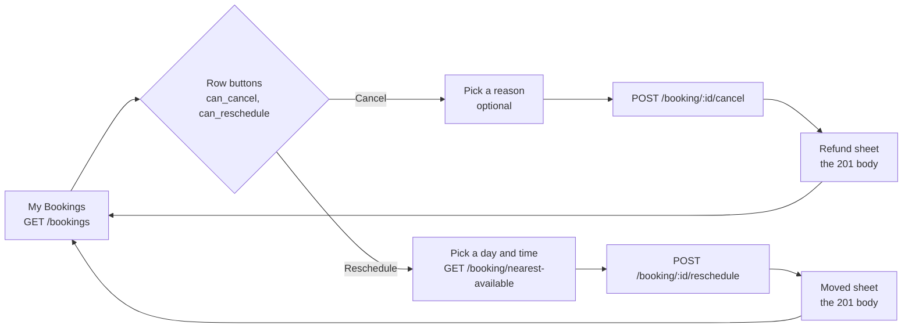

# Mobile Single Booking Cancel and Reschedule: FE Guide

Date: 2026-10-08. For: the mobile app team.

A single booking is one visit, for one customer, at one salon (`booking_type:
"SINGLE"` on My Bookings). This guide covers the two buttons on its row:
**Cancel** and **Reschedule**. Parties (`GROUP`) and routines (`ROUTINE`) keep
their own guides: `docs/MOBILE_GROUP_BOOKING_FE.md` and
`docs/MOBILE_ROUTINE_BOOKING_FE.md`.

**Everything here is behind the server switch `SINGLE_BOOKING_ACTIONS_V1`, and
it is OFF today.** Until it is on, both buttons are `false` on every single row
and both routes answer `404`. See §10.

---

## 0. Read this first

1. **Base URL:** `https://api.gostyle.uk/api/v1`. Every path below is relative
   to it.
2. **Auth:** `Authorization: Bearer <app login token>` on every call. The
   customer is always the signed-in user, never a field in the body.
3. **Body:** `Content-Type: application/json` whenever you send a body. Keys
   are `snake_case`.
4. **Buttons come from the server.** Show Cancel only when the row's
   `can_cancel` is `true`, and Reschedule only when its `can_reschedule` is
   `true` (§3). Never work the rule out in the app.
5. **Two error shapes.** These routes answer refusals in **two** shapes: this
   service's envelope `{detail, code, errors[]}` and booking-api's
   `{statusCode, code, message}`. Check which one you got before you branch
   (§8).
6. **Success is `201`.** Both routes answer `201 Created` with booking-api's
   own answer. Treat any `2xx` as success.
7. **Switch:** off today. Both routes answer `404` until the backend turns it
   on (§10).

---

## 1. Endpoints at a glance

| Method | Path | Does | § |
| ------ | ---- | ---- | -- |
| `GET`  | `/bookings?filter=upcoming` | The rows, with `can_cancel` and `can_reschedule`. | 3 |
| `POST` | `/booking/{id}/cancel` | Cancel one single booking. Optional reason. | 5 |
| `POST` | `/booking/{id}/reschedule` | Move one single booking to a new time, and maybe a new stylist. | 6 |
| `GET`  | `/booking/nearest-available/{salon_id}` | Free starts for the Reschedule time picker. Already built. | 6 |
| `GET`  | `/salon/{id}/stylists?service_ids=` | Stylists for "change stylist". Already built. | 6 |

`{id}` is the row's `id`. `POST /booking/{id}/cancel` is the same path a party
uses: the server looks the id up and only cancels it as a single booking when
the row is `SINGLE` (§5).

---

## 2. The flow



| Screen | Call | Notes |
| ------ | ---- | ----- |
| My Bookings, Upcoming | `GET /bookings?filter=upcoming` | Draw the buttons from `can_cancel` and `can_reschedule`. |
| Cancel sheet | none | A reason picker. "No reason" is allowed. |
| Confirm cancel | `POST /booking/{id}/cancel` | Disable the button while it runs. |
| Cancelled | none | Use the `201` body: `outcome`, `refund`, `kept`. Then reload the list. |
| Reschedule: day and time | `GET /booking/nearest-available/{salon_id}` | One call per day picked. |
| Reschedule: stylist (optional) | `GET /salon/{id}/stylists?service_ids=` | Leave it out to keep the same stylist. |
| Confirm move | `POST /booking/{id}/reschedule` | Disable the button while it runs. |
| Moved | none | Use the `201` body: `to`, `depositOutcome`, `nowRequires`. Then reload the list. |

---

## 3. Which buttons to show

On the Upcoming and Archive tabs, each row carries `can_cancel` and
`can_reschedule`. **Show a button only when its field is `true`.** The server
already checked the booking type, the status, the salon's window and the
stylist count.

A single row, trimmed to the fields this guide uses (the rest are in
`docs/BOOKING_LIST_API.md` §4):

```json
{
  "id": "9f1c0f4e-3a2b-4d55-9a71-2c8e5b0d7a11",
  "salon_id": "branch-1",
  "status": "CONFIRMED_BY_SALON",
  "booking_type": "SINGLE",
  "date": "2026-10-20",
  "start_time": "2026-10-20T20:00:00+04:00",
  "end_time": "2026-10-20T20:45:00+04:00",
  "services": [{ "id": "0b7c0000-0000-4000-8000-000000000001", "name": "Cut" }],
  "stylists": [{ "id": "7d1e0000-0000-4000-8000-00000000000a", "name": "Maya E.", "avatar_url": null }],
  "salon": { "id": "c6c248ab-f2cd-4f12-a31e-243c6e64b3b5", "name": "Marina Walk", "logo_url": null, "city": "Dubai" },
  "can_cancel": true,
  "can_reschedule": true
}
```

The rule the server uses (switch on):

| `booking_type` | `can_cancel` | `can_reschedule` |
| -------------- | ------------ | ---------------- |
| `SINGLE`, no stylist or one stylist | the salon's window | the salon's window |
| `SINGLE`, **two or more stylists** | the salon's window | **always `false`** |
| `GROUP` | the salon's window | always `false` |
| `ROUTINE` | always `false` | always `false` |
| missing or unknown | always `false` | always `false` |

- **"The salon's window"** means: the booking is `BOOKED` or
  `CONFIRMED_BY_SALON`, and the start is more than the salon's
  `cancel_window_hours` away. A salon with no window allows it until the start.
- **A `CHECKED_IN` booking shows neither button**, whatever its type: once the
  customer is checked in, only the salon can cancel, and nobody can move it.
- **A single booking with two stylists shows no Reschedule button.** A move
  can put the visit with one stylist only, so the route refuses it (`422
  multiple_stylists`). Cancel still shows: a cancel works with any number of
  stylists. The same stylist listed twice counts as one.
- **A single booking with no stylist** shows Reschedule. The customer must
  then pick a stylist on the Reschedule screen (§6, `stylist_required`).
- **Switch off (today):** both fields are `false` on every `SINGLE` row.
- **The window is not the refund rule.** The button follows the salon's
  window. What the customer gets back is booking-api's policy (§5). They can
  differ: a salon with a 0 hour window lets a customer cancel 1 hour before,
  and that is a late cancel.
- The Recurring tab has no row buttons. A routine's sessions have their own
  `can_skip` and `can_reschedule` (routine guide §10).

---

## 4. TypeScript types (copy these)

```ts
type UUID = string;
/** ISO 8601 with an offset. List rows use the salon's offset. */
type ISODateTime = string;
/** "YYYY-MM-DD", the salon's date. */
type ISODate = string;

// ---------- the parts of a list row this guide uses ----------
interface SingleBookingRow {
  id: UUID;                          // what both routes take
  salon_id: string;                  // booking-api's own name for the salon. NOT for salon routes.
  booking_type: 'SINGLE' | 'GROUP' | 'ROUTINE' | string;
  status: string;
  date: ISODate;
  start_time: ISODateTime;           // salon's offset
  end_time: ISODateTime;
  services: { id: UUID; name: string | null }[];
  stylists: { id: UUID; name: string | null; avatar_url: string | null }[];
  salon: { id: UUID; name: string; logo_url: string | null; city: string | null } | null;
  can_cancel: boolean;
  can_reschedule: boolean;
}

// ---------- POST /booking/{id}/cancel ----------
type CancelReason = 'NOT_SATISFIED' | 'TOO_EXPENSIVE' | 'MOVING' | 'OTHER';
interface CancelRequest {
  reason?: CancelReason | null;      // optional. Left out, null or "" = no reason.
}

// 201: booking-api's answer, passed through as it came (camelCase).
interface CancelResult {
  code: string;                      // the booking code, e.g. "GS-1042"
  bookingId: UUID;
  from: string;                      // the state before, in capitals, e.g. "CONFIRMED"
  to: 'CANCELLED';
  paymentStatus: string;             // the payment state after, in capitals, e.g. "REFUNDED"
  refund: string;                    // "AED 54.07": what goes back to the customer
  refundMinor: number;               // the same in fils: 5407
  kept: string;                      // "AED 0.00": what the salon keeps
  keptMinor: number;                 // the same in fils
  lateCancel: boolean;               // true when cancelled less than 2 hours before the start
  outcome: 'REFUNDED' | 'PARTIALLY_REFUNDED' | 'DEPOSIT_KEPT' | 'NO_CHARGE';
  explanation: string;               // a sentence written for the salon desk (see §5)
}

// ---------- POST /booking/{id}/reschedule ----------
interface RescheduleRequest {
  date: ISODate;                     // the new day, salon's date
  time: string;                      // "HH:MM", the new start on the salon's clock
  stylist_id?: UUID | null;          // left out or null = keep the booking's own stylist
}

// 201: booking-api's answer, passed through as it came (camelCase).
interface RescheduleResult {
  code: string;                      // the booking code. Unchanged by a move.
  from: string;                      // the old start, UTC: "2026-10-20T16:00:00.000Z"
  to: string;                        // the new start, UTC: "2026-10-22T15:00:00.000Z"
  moveCount: number;                 // how many times this booking has moved, this one included
  lateMove: boolean;                 // true when moved less than 2 hours before the OLD start
  deposit: string;                   // "AED 0.00": the deposit carried, or the one forfeited
  depositOutcome: 'CARRIED' | 'FORFEITED';
  nowRequires?: string;              // only from the 4th move of a booking with no deposit: "AED 24.00"
  explanation: string;               // a sentence written for the salon desk (see §6)
}

// ---------- errors: two shapes (§8) ----------
/** Shape A: this service's envelope. */
interface ApiError {
  detail: string;                    // a sentence you can show as it is
  code: string;                      // "validation_error" on a 422; the error's own code on 401/404/415/503
  errors: { field: string | null; code: string; message: string }[];
}
/** Shape B: booking-api's own shape, passed through. */
interface BookingApiError {
  statusCode: number;
  code: string;                      // UPPER_CASE, e.g. "BOOKING_NOT_FOUND"
  message: string;                   // written for the salon desk. Do not show it (§8).
  details?: Record<string, unknown>; // sometimes. Do not use it (§8).
  error: string;                     // the status as a word, e.g. "Not Found"
}
```

---

## 5. Cancel: `POST /booking/{id}/cancel`

Cancels one single booking. booking-api decides the refund and the answer
comes back exactly as booking-api wrote it.

### Request

```http
POST /booking/9f1c0f4e-3a2b-4d55-9a71-2c8e5b0d7a11/cancel
Content-Type: application/json
```

```json
{ "reason": "MOVING" }
```

Or no body at all: an empty body is fine, with or without a content type.

| Field | Required | Notes |
| ----- | -------- | ----- |
| `reason` | no | One of the four below. Left out, `null`, `""` or spaces = no reason. Any other value is `422 invalid_cancel_reason` and nothing is cancelled. |

| `reason` | Label to show |
| -------- | ------------- |
| `NOT_SATISFIED` | Not satisfied |
| `TOO_EXPENSIVE` | Too expensive |
| `MOVING` | Moving away |
| `OTHER` | Other |

These are the same four as a routine's cancel. The values are exact and in
capitals: `"moving"` is refused. Any other key in the body is ignored. The
reason is kept in the booking's history only, as "Cancelled by the customer
in the app. Reason: MOVING."

### Response: `201 Created`

```json
{
  "code": "GS-1042",
  "bookingId": "9f1c0f4e-3a2b-4d55-9a71-2c8e5b0d7a11",
  "from": "CONFIRMED",
  "to": "CANCELLED",
  "paymentStatus": "REFUNDED",
  "refund": "AED 54.07",
  "refundMinor": 5407,
  "kept": "AED 0.00",
  "keptMinor": 0,
  "lateCancel": false,
  "outcome": "REFUNDED",
  "explanation": "Refunded in full (AED 54.07) to the wallet."
}
```

This is booking-api's own answer, so its keys are **camelCase**, and it is not
the booking object `GET /booking/{id}` answers.

### The refund fields

What comes back depends on what was paid in the app and how close the start
is. booking-api decides it; the app only shows it.

| When the customer cancels | `outcome` | `refund` / `kept` | `lateCancel` | `explanation` |
| ------------------------- | --------- | ----------------- | ------------ | ------------- |
| Nothing was paid in the app (pay at the salon), at any time | `NO_CHARGE` | both `AED 0.00` | `false` | "No charge. Any pending payment intent is voided." |
| Paid in the app, more than 24 hours before the start | `REFUNDED` | all of it / `AED 0.00` | `false` | "Refunded in full (AED 54.07) to the wallet." |
| Paid in the app, 24 to 2 hours before | `DEPOSIT_KEPT` | `AED 0.00` / all of it | `false` | "Deposit kept (AED 20.00) per policy." |
| Paid in the app, less than 2 hours before | `DEPOSIT_KEPT` | `AED 0.00` / all of it | `true` | "Late cancel. AED 20.00 kept, and it weighs more in the risk score." |

- **Build the sheet from `outcome` and the amounts.** For example
  `REFUNDED`: "AED 54.07 will be refunded to your wallet." `DEPOSIT_KEPT`:
  "The salon keeps your deposit of AED 20.00." `NO_CHARGE`: "Nothing was
  charged."
- **`explanation` is written for the salon desk.** The late cancel one talks
  about a risk score. Do not show it to the customer as it is.
- **`refundMinor` and `keptMinor`** are the same amounts in fils (1 AED = 100
  fils). Use them for any maths; use `refund` and `kept` for display.
- **`PARTIALLY_REFUNDED`** is in booking-api's list but a customer cancel does
  not produce it today. Handle it anyway: "AED X refunded, AED Y kept".
- **`paymentStatus`** is booking-api's payment state after the cancel:
  `REFUNDED` or `FORFEITED` when money moved, otherwise unchanged. Show
  `outcome`, not this.
- **After the cancel**, reload the list. The booking leaves Upcoming and shows
  in Archive as `CANCELLED`.

---

## 6. Reschedule: `POST /booking/{id}/reschedule`

Moves one single booking to a new day and time, and to a new stylist if the
customer picks one. The booking keeps its `id` and its code.

### Pick the new time first

Use `GET /booking/nearest-available/{salon_id}` (see
`docs/BOOKING_NEAREST_AVAILABLE_API.md`) for the day the customer picks:

- `{salon_id}` is the row's **`salon.id`**, not the row's `salon_id` (that one
  is booking-api's own name, for example `"branch-1"`).
- `service_ids` = the row's `services[].id`, comma separated.
- `stylist_id` = the stylist the booking will have: the row's
  `stylists[0].id`, or the new one the customer picked.
- `from` and `to` = that one salon day, with the offset (`%2B04:00`).
- The customer taps an offer. Its `start` gives the body:
  `date` = the first 10 characters, `time` = characters 11 to 16.
  `"2026-10-22T19:00:00+04:00"` gives `date: "2026-10-22"`, `time: "19:00"`.

Send only offered times. A typed time will often be refused.

### Request

```http
POST /booking/9f1c0f4e-3a2b-4d55-9a71-2c8e5b0d7a11/reschedule
Content-Type: application/json
```

Same stylist:

```json
{ "date": "2026-10-22", "time": "19:00" }
```

Another stylist:

```json
{ "date": "2026-10-22", "time": "19:00", "stylist_id": "7d1e0000-0000-4000-8000-00000000000b" }
```

| Field | Required | Notes |
| ----- | -------- | ----- |
| `date` | yes | `YYYY-MM-DD`, the salon's date. |
| `time` | yes | `HH:MM` on a 24 hour clock, the salon's time. `19:00`, not `7pm`, not `19:00:00`. |
| `stylist_id` | no | Left out or `null`: the booking keeps its own stylist. An id: the booking moves to that stylist. |

Any other key is ignored. There is no `reason` (booking-api's history gets
"Rescheduled by the customer in the app."). The services never change: they
come from the booking.

### The stylist rule

| The booking has | `stylist_id` sent | Result |
| --------------- | ----------------- | ------ |
| one stylist | left out or `null` | Moves with the same stylist. |
| one stylist | an id | Moves to that stylist, if they work at this salon (`foreign_id`) and can do every service of the booking (`stylist_mismatch`). |
| no stylist | left out or `null` | `422 stylist_required`. The server never picks "anyone free": ask the customer to choose. |
| no stylist | an id | Moves with that stylist, same checks as above. |
| two or more stylists | anything | `422 multiple_stylists`, even when the body has other mistakes. The row shows no Reschedule button for this booking (§3). |

### What the server does

1. Checks the id is a `SINGLE` booking on the first page (50 rows) of the
   customer's own Upcoming tab. Anything else is `404`.
2. Checks the body, the stylist and the services.
3. Checks the new time against the salon's own hours, closed days and the
   services' notice (`salon_closed`, `outside_hours`, `too_soon`).
4. Holds the new time at booking-api, then moves the booking onto it.
5. If the move fails, gives the held time back at once.

Steps 1 to 3 answer in this service's envelope. Step 4 can answer in
booking-api's shape (§8).

### Response: `201 Created`

```json
{
  "code": "GS-1042",
  "from": "2026-10-20T16:00:00.000Z",
  "to": "2026-10-22T15:00:00.000Z",
  "moveCount": 1,
  "lateMove": false,
  "deposit": "AED 0.00",
  "depositOutcome": "CARRIED",
  "explanation": "Moved within policy. Nothing was captured, so nothing changes."
}
```

This is booking-api's own answer, so its keys are **camelCase**.

- **`from` and `to` are UTC** (they end in `Z`). Show them in the salon's time:
  use the offset of the row's `start_time`. Above, `15:00Z` is 19:00 in Dubai.
- **`code`** is the same booking code as before. The pass does not change.
- **`moveCount`** counts every move of this booking, this one included.

### The deposit fields

| When | `depositOutcome` | `deposit` | `lateMove` | `nowRequires` | `explanation` |
| ---- | ---------------- | --------- | ---------- | ------------- | ------------- |
| Nothing was paid in the app | `CARRIED` | `AED 0.00` | `false` | absent | "Moved within policy. Nothing was captured, so nothing changes." |
| A deposit was paid | `CARRIED` | the deposit | `false` | absent | "Moved within policy. AED 20.00 carries to the new time untouched." |
| Moved less than 2 hours before the OLD start | `FORFEITED` | what was forfeited | `true` | absent | "Moved inside the 2-hour window, so this counts as a late cancel. AED 20.00 is forfeited and the new time is quoted fresh." |
| The 4th move (or later) of a booking with no deposit | `CARRIED` | `AED 0.00` | `false` | **the new deposit** | "Move 4. A 20% deposit of AED 24.00 is now required, and a payment link has been sent." |

- **`CARRIED`:** say "Your booking moved to Thu 22 Oct, 19:00." and, when
  `deposit` is not `AED 0.00`, "Your deposit of AED 20.00 moves with it."
- **`FORFEITED`:** say the deposit was lost because the move was less than 2
  hours before the old time. With nothing paid, `deposit` is `AED 0.00` and
  there is nothing to say about money.
- **`nowRequires` present:** the booking now needs a 20% deposit (the amount
  in `nowRequires`) and goes back to waiting for payment. Tell the customer,
  then reload the booking with `GET /booking/{id}` to show its new state.
- **`explanation` is written for the salon desk.** Build your own sentence
  from the fields above.
- **After the move**, reload the list. The row shows the new `start_time`.

---

## 7. Checklist for the two calls

| | Cancel | Reschedule |
| - | ------ | ---------- |
| Show the button when | `can_cancel: true` | `can_reschedule: true` |
| Body | none, or `{ "reason": ... }` | `{ "date", "time", "stylist_id"? }` |
| Success | `201`, `CancelResult` | `201`, `RescheduleResult` |
| Keys of the success body | camelCase | camelCase |
| `Idempotency-Key` | optional, passed to booking-api | not used |
| After success | reload the list | reload the list |

---

## 8. Errors: two shapes

A refusal from these two routes arrives in **one of two shapes**. Look at the
body first, then branch:

```ts
function isApiError(body: unknown): body is ApiError {
  return typeof body === 'object' && body !== null && Array.isArray((body as ApiError).errors);
}
function isBookingApiError(body: unknown): body is BookingApiError {
  return typeof body === 'object' && body !== null && typeof (body as BookingApiError).statusCode === 'number';
}
```

### Shape A: this service's envelope `{detail, code, errors[]}`

The same envelope as the rest of this API. Everything this service checks
itself answers in it: the switch, the lookup, the body, the stylist, the
salon's hours, and booking-api being unreachable.

```json
{
  "detail": "Please correct the highlighted fields.",
  "code": "validation_error",
  "errors": [
    {
      "field": "time",
      "code": "outside_hours",
      "message": "A visit on 2026-10-22 at 20:15 would not start and finish within the salon's hours."
    }
  ]
}
```

- **Branch on `errors[0].code`.** On a `422` the top `code` is always
  `validation_error`; on a `404`, `415` or `503` it is the error's own.
- **Highlight `errors[0].field`** when it is not `null`.
- **`detail` and `message` are safe to show** to the customer. When the only
  error has `field: null`, `detail` is that error's message:

```json
{
  "detail": "This booking has more than one stylist, so it cannot be moved in the app. Please contact the salon.",
  "code": "validation_error",
  "errors": [
    {
      "field": null,
      "code": "multiple_stylists",
      "message": "This booking has more than one stylist, so it cannot be moved in the app. Please contact the salon."
    }
  ]
}
```

### Shape B: booking-api's `{statusCode, code, message}`

When booking-api itself refuses the cancel or the move, its answer is passed
through as it came: its status and its body. This is on purpose: it is
booking-api's decision about the booking.

```json
{
  "statusCode": 404,
  "code": "BOOKING_NOT_FOUND",
  "message": "No such booking",
  "error": "Not Found"
}
```

- **Branch on `code`** (UPPER_CASE). For a `410`, branch on the status: its
  `code` does not say what happened (§8 tables).
- **Do not show `message`.** It is written for the salon desk, and on a
  refusal of the new time it names the time on booking-api's own clock, not
  the salon's: for 19:00 in Dubai it says "21:00 is no longer available.
  Offers have refreshed." Show your own sentence per code.
- **Ignore `details`.** Its `offers` use booking-api's clock too. Reload the
  time picker instead.
- There is no `errors` array and no `field`.

### Cancel: every refusal

| Status | Shape | Code | When | App action |
| ------ | ----- | ---- | ---- | ---------- |
| `422` | A | `invalid_cancel_reason` (field `reason`) | `reason` is not one of the four. Nothing was cancelled. | App bug: send one of the four, or no reason. |
| `415` | A | `unsupported_media_type` | A body was sent, not as `application/json`. | App bug. |
| `401` | A | `not_authenticated` | No token, or it expired. | Refresh the token, retry. |
| `404` | A | `not_found` (field `id`) | Not a single booking on the first page of this customer's Upcoming: already cancelled (a second tap), someone else's, a routine session, past the first 50 upcoming, or the lookup failed. Also: the switch is off. | Show "This booking can't be cancelled here", reload the list. If the row is now in Archive as `CANCELLED`, the first cancel worked. |
| `503` | A | `service_unavailable` (`errors[0].code: booking_api_unavailable`) | booking-api did not answer. The cancel may or may not have happened. | Reload the list first. If the booking is still on Upcoming, try again. |
| `403` | B | `FORBIDDEN_ROLE` | The customer was checked in after the list loaded: only the salon can cancel now. | "Please ask the salon to cancel." Reload the list. |
| `409` | B | `BOOKING_STATE_INVALID` | The booking cannot be cancelled in its state now, for example the service has started (rare). | "This booking can no longer be cancelled." Reload the list. |
| `404` | B | `BOOKING_NOT_FOUND` | The booking went between the list and the cancel (rare). | Reload the list. |
| other `4xx` / `5xx` | B | any | Not expected. | "Something went wrong. Please try again." Reload the list. |

A `404` on cancel arrives in shape A both when the switch is off and when the
id is not a single booking: the id then goes on to the party cancel, which
answers this body:

```json
{
  "detail": "Please correct the highlighted fields.",
  "code": "not_found",
  "errors": [{ "field": "id", "code": "not_found", "message": "No such booking." }]
}
```

### Reschedule: every refusal

Nothing moves on any refusal. When booking-api refuses the move after the
new time was held, the held time is given back at once.

| Status | Shape | Code | When | App action |
| ------ | ----- | ---- | ---- | ---------- |
| `404` | A | `not_found` | The switch is off; or not a single booking on the first page of this customer's Upcoming (a party, a routine session, someone else's, past the first 50, the lookup failed); or the salon cannot be found. | Show "This booking can't be moved here", reload the list. |
| `415` | A | `unsupported_media_type` | Body not `application/json`. | App bug. |
| `401` | A | `not_authenticated` | No token, or it expired. | Refresh the token, retry. |
| `422` | A | `required` (field `date` or `time`) | A field is missing. | App bug. |
| `422` | A | `invalid` (field `date` or `stylist_id`) | `date` is not `YYYY-MM-DD`; `stylist_id` is not a UUID. | App bug. |
| `422` | A | `invalid_time` (field `time`) | `time` is not `HH:MM` (24 hour). | App bug. |
| `422` | A | `multiple_stylists` (field `null`) | The booking has two or more stylists. | Show `detail`. The button should not have shown: reload the list. |
| `422` | A | `stylist_required` (field `stylist_id`) | The booking has no stylist and none was sent. | Ask the customer to pick a stylist, send again. |
| `422` | A | `foreign_id` (field `stylist_id`) | That stylist does not work at this salon. | Reload the stylists, pick again. |
| `422` | A | `stylist_mismatch` (field `stylist_id`) | That stylist cannot do every service of the booking. | Pick another stylist, or keep the current one. |
| `422` | A | `foreign_id` (field `services`) | A service of the booking is no longer offered online at this salon. | "This booking can't be moved in the app. Please contact the salon." |
| `422` | A | `salon_closed` (field `time`) | The salon is closed that day. | Pick another day. |
| `422` | A | `outside_hours` (field `time`) | The visit would not start and finish inside the salon's hours. Also a time booking-api's day cannot take (§9). | Pick another time. |
| `422` | A | `too_soon` (field `time`) | The time has passed, or is inside a service's notice. | Pick a later time. |
| `422` | A | `reschedule_refused` (field `null`) | booking-api refused to hold that time for another reason (rare). | Show `detail`, pick another time. |
| `503` | A | `service_unavailable` (`errors[0].code: booking_api_unavailable`) | booking-api did not answer. The move may or may not have happened. | Reload the list and look at the row's `start_time` before trying again. |
| `409` | B | `BOOKING_STAFF_UNAVAILABLE` | The stylist is not free at that time any more. The usual "time was taken" answer, because a move always names a stylist. | "That time was just taken." Reload the time picker. |
| `409` | B | `BOOKING_SLOT_TAKEN` | Someone took that time while the customer was deciding. | Same as above. |
| `409` | B | `BOOKING_CAPACITY_BLOCKED` | Every station the service needs is taken at that time. | Pick another time. |
| `409` | B | `BOOKING_SKILL_MISSING` | booking-api says the stylist lacks a skill for these services. | Pick another stylist. |
| `422` | B | `BOOKING_STAFF_UNKNOWN` | booking-api does not know that stylist at this salon. | Pick another stylist. |
| `404` | B | `BOOKING_NOT_FOUND` | booking-api does not find a service of the booking, or the booking itself went (rare). | Reload the list. If it persists: "Please contact the salon." |
| `409` | B | `BOOKING_STATE_INVALID` | The booking cannot be moved in its state now, e.g. checked in after the list loaded. | "This booking can no longer be moved." Reload the list. |
| `410` | B | (branch on the status) | The held time lapsed before the move (rare). The booking is untouched. | Reload the time picker and try again. |
| other `4xx` / `5xx` | B | any | Not expected. | "Something went wrong. Please try again." Reload the list. |

A refusal in shape B from the hold step (`BOOKING_STAFF_UNAVAILABLE`,
`BOOKING_SLOT_TAKEN`, `BOOKING_CAPACITY_BLOCKED`) carries a `details.offers`
list and a `message` with a time in it. Both are on booking-api's clock:
ignore them.

---

## 9. Retries, double taps and known limits

### Retries and double taps

- **Disable the button** while a cancel or a move is in flight.
- **Cancel twice:** the first cancel moves the booking off Upcoming, so the
  second answers `404 not_found` (shape A) and cancels nothing. Treat that
  `404` as "reload the list".
- **Cancel, timeout or `503`:** reload the list. If the booking is gone from
  Upcoming, the cancel worked; if not, cancel again. An `Idempotency-Key`
  header is optional on the cancel and is passed on to booking-api, but it is
  not needed.
- **Move twice:** the second move holds afresh and usually finds the time
  taken by the first (`409 BOOKING_STAFF_UNAVAILABLE`, shape B). Do not send
  a second move until the first has answered.
- **Move, timeout or `503`:** reload the list and look at the row's
  `start_time`. If it shows the new time, the move worked. No
  `Idempotency-Key` is used on the move.

### Known limits today

| Limit | What the app does |
| ----- | ----------------- |
| **Two or more stylists:** a single booking with more than one stylist cannot be moved in the app. | `can_reschedule` is `false` for it. "Please contact the salon." |
| **First 50 upcoming only:** the server looks the booking up on the first page (50 rows) of the customer's Upcoming tab. | Nothing. A booking past the 50th answers `404`. Not a real case today. |
| **UAE salons: 08:00 to 20:00 salon time.** booking-api's day runs 10:00 to 22:00 on its own `+06:00` clock, so a move in Dubai must start and finish between 08:00 and 20:00. Outside it, the move is refused: `422 outside_hours` (shape A), or a `409` (shape B). | Send only times `nearest-available` offered. |
| **No reason on a move.** booking-api needs one and the server always sends "Rescheduled by the customer in the app." | No reason picker on Reschedule. |
| **Services cannot change on a move.** | Only the time and the stylist. To change services, cancel and book again. |
| **Parties and routines** are not moved by these routes. | `can_reschedule` is `false` on their rows. Routine sessions move from the routine (routine guide §12). |
| **The 4th move of a free booking** needs a 20% deposit (`nowRequires`). | Tell the customer; reload the booking (§6). |

---

## 10. Rollout: `SINGLE_BOOKING_ACTIONS_V1`

Both routes and both buttons are behind the server switch
`SINGLE_BOOKING_ACTIONS_V1`. **It is off today**, in every environment, until
the backend turns it on. While it is off:

- every `SINGLE` row has `can_cancel: false` and `can_reschedule: false`;
- `POST /booking/{id}/reschedule` answers `404` for every id:

```json
{
  "detail": "Not found",
  "code": "not_found",
  "errors": [{ "field": null, "code": "not_found", "message": "Not found" }]
}
```

- `POST /booking/{id}/cancel` with a single booking's id answers `404` too:
  the id goes on to the party cancel, as it always did, which answers the
  shape A `not_found` body in §8. A party's cancel is unchanged either way.
- an `{id}` that is not a UUID gets a plain HTML `404`, not the envelope. This
  is the same with the switch on.

Ask the backend team to confirm the switch is on in the environment before
testing these screens.

---

## 11. QA checklist

- [ ] Switch off: no Cancel or Reschedule on any `SINGLE` row; both routes answer `404`.
- [ ] Switch on: a single booking well ahead shows both buttons; one inside the salon's window shows neither.
- [ ] A single booking with two stylists shows Cancel but no Reschedule.
- [ ] A `GROUP` row still shows only Cancel; a `ROUTINE` row shows neither.
- [ ] A `CHECKED_IN` booking, single or party, shows neither button.
- [ ] Cancel with no reason, and with each of the four reasons: `201`, the sheet built from `outcome` and the amounts.
- [ ] Cancel a pay-at-the-salon booking: `NO_CHARGE`, no money wording.
- [ ] Tap Cancel twice fast: one cancel; the button is disabled while it runs; a late `404` reloads the list.
- [ ] After a cancel, the booking is in Archive as `CANCELLED`.
- [ ] Reschedule with the same stylist: the time picker offers free starts; `201`; the row shows the new time in salon time.
- [ ] Reschedule to another stylist who does the services: `201`. One who does not: `422 stylist_mismatch`.
- [ ] A booking with no stylist: Reschedule without picking one gives `422 stylist_required`; after picking, `201`.
- [ ] Pick a time someone else then books: `409` in shape B; the app shows its own "time was taken" sentence, not booking-api's `message`, and reloads the picker.
- [ ] A closed day: `422 salon_closed` on `time`.
- [ ] `from` and `to` in the move answer are shown in salon time, not UTC.
- [ ] Error handling tells shape A (`errors[]`) from shape B (`statusCode`) and never shows a raw booking-api `message`.
